# Attendance Flow — How It Actually Works

> Reference document for the STMC attendance system (v2).
> It describes **what each role does, when they do it, and how the system validates it**,
> for the two kinds of class that generate attendance: **regular classes** and
> **make-up classes (reposiciones)**.
>
> Every screenshot in this document was taken from the application running against a
> real PostgreSQL database with demo data — not from mock-ups.
> Source of truth for the rules: `server/src/routes/sessions.js`,
> `server/src/routes/makeups.js`, `server/src/services/consolidation.js`,
> `server/src/services/costEngine.js`, `server/src/lib/assistantMatch.js`.

---

## 1. Vocabulary

| Term | Meaning |
|---|---|
| **Session** (`ClassSession`) | One class on one date. `kind` = `REGULAR` (a group's class), `MAKEUP` (reposición) or `FESTIVAL`. |
| **Report** (`ClassReport`) | A *draft* of the attendance of a regular class, written by one role (`PROFESSOR` or `COORDINATOR`). Two reports per session, at most. |
| **Consolidation** | The comparison of the two reports. Only a match produces official attendance and payment. |
| **Attendance record** (`AttendanceRecord`) | The **official** attendance of a student in a session. Written by the system, never directly by a user. |
| **Cost record** (`CostRecord`) | The amount owed to a professor or an assistant for one session, with a `payStatus`. |
| **Accompaniment** | An assistant declaring "I was in this class". It is not an attendance report. |
| **Fortnight** (`period`) | Payroll half-month, stored as `2026-09-1` (days 1–15) or `2026-09-2` (16–end). |
| **Units** (`effectiveUnits`) | How many attendances a session is worth. Always `1` for regular classes; `1` or `2` for make-ups. |

### Roles

| Enum value | Label in the UI | Part in the attendance flow |
|---|---|---|
| `TEACHER` | Profesor | Writes the **professor report** of their own groups; reports the make-ups assigned to them. |
| `PHYSICAL_TRAINER` | **Coordinador** | Writes the **coordinator report** of *any* group; creates and manages make-ups. Never sees money. |
| `ASSISTANT` | Asistente | Only marks the classes they accompanied. Cannot report attendance. |
| `ADMIN` | Administrador | **Read-only** on attendance. Owns the money: unlocks late payments, approves, pays and closes the fortnight. |
| `SUPERADMIN` | Superadministrador | Superset of ADMIN. The only role that may write *either* of the two reports (must state which). |
| `RECEPTION` / `PARENT` | Recepción / Acudiente | Outside the attendance flow (students, payments, parent portal). |

---

## 2. The two flows at a glance

| | Regular class | Make-up class (reposición) |
|---|---|---|
| Who creates the session | The first reporter (professor or coordinator) opening the flow — or an assistant marking accompaniment | The **coordinator/admin**, in advance, from `/admin/makeups` |
| Who reports attendance | **Two people, independently**: professor **and** coordinator | **One person**: the assigned professor, or the coordinator/admin |
| How it is validated | **Double report + consolidation**: both must coincide | The coordinator's decisions are already recorded at creation; the report is taken as final |
| When attendance becomes official | Only when both reports match (`MATCHED`) | Immediately on the report |
| When payment is calculated | On the match | On the report |
| Worth in the student's package | 1 attendance | `effectiveUnits` — 1 (simple) or 2 (double) |
| Students | The group roster (+ guests: make-up visitors, trial students) | Only the students assigned when it was created |

---

## 3. Regular class — the five steps

The professor and the coordinator each walk through the **same** screens; the system knows
which of the two reports it is writing from the role of whoever is logged in
(`TEACHER → PROFESSOR`, `PHYSICAL_TRAINER → COORDINATOR`). A blue banner states it on every screen.

### 3.0 Starting point — the day's dashboard

The professor sees only their own groups; the coordinator sees all of them.
Red banner = classes not reported yet (which suspends payment, see §6).
Green card = already consolidated, or "✓ Reportada por mí" when only my own report is in.

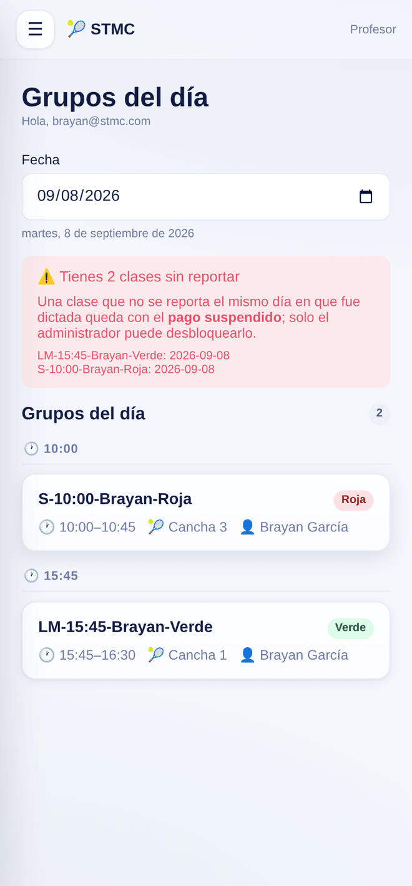

### Step 1 — Was the class held?

`POST /api/sessions` creates (or reuses) the session for that group + date, with status
`PROGRAMADA`. A `UNIQUE(groupId, date)` constraint in the database guarantees that the
professor and the coordinator always land on the **same** session object.

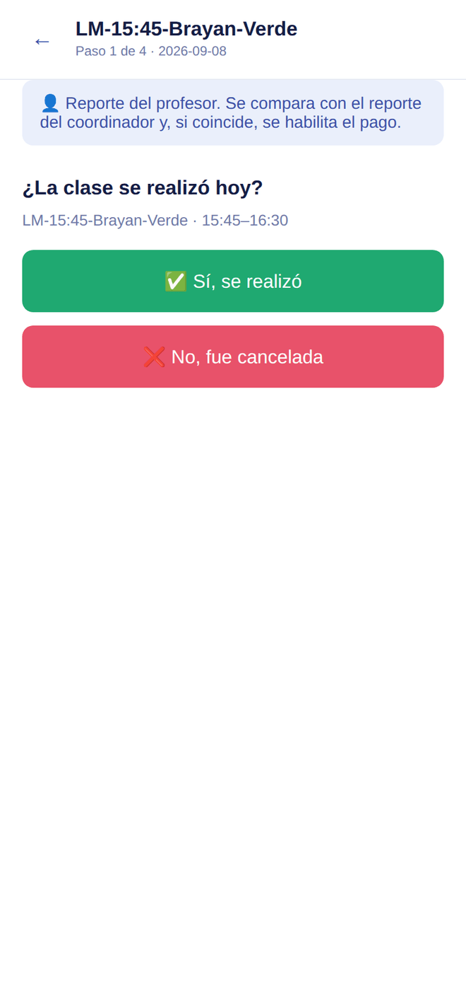

If the class was **not** held, the cancellation is structured — the reason is a category,
not free text (`LLUVIA`, `SIN_ESTUDIANTES`, `OTRA`; only `OTRA` requires a description).
`POST /api/sessions/:id/cancel` sets `CANCELADA` and **deletes any cost record** of that session.
Rain cancellations feed the per-group rain alert.

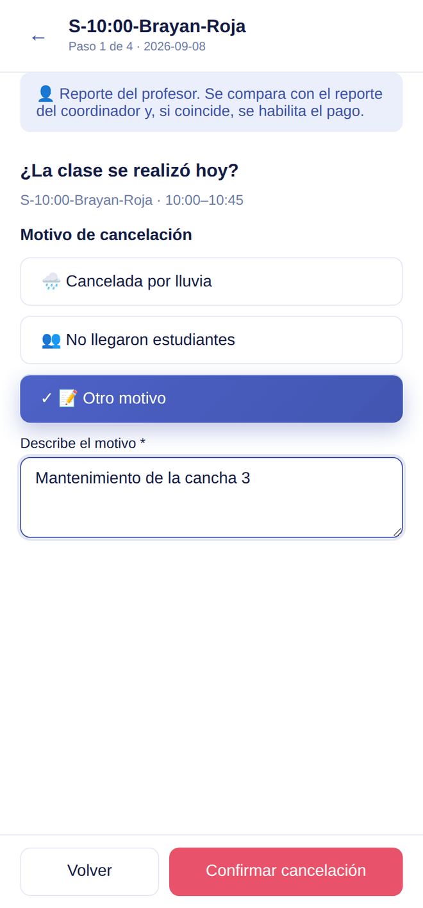

### Step 2 — Who taught, and who assisted?

Default: the group's titular professor. The assistant is optional and is chosen here —
this is the **professor's declaration** about the assistant, one of the three legs of the
triple coincidence (§5).

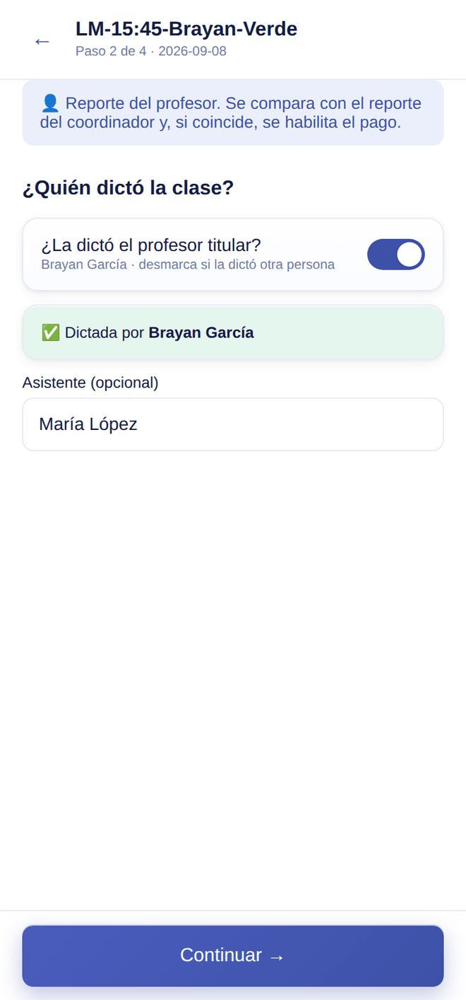

Turning off *"¿La dictó el profesor titular?"* forces two things, both validated server-side:
the substitute who actually taught, and a **mandatory written note**. Payment then follows
the substitute, not the titular.

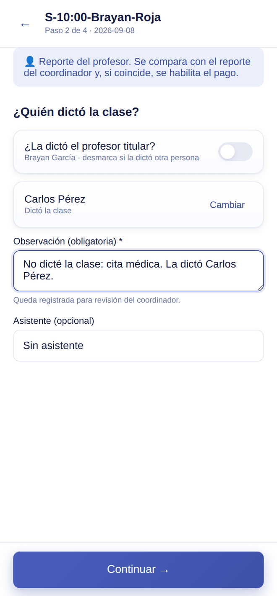

### Step 3 — The roster

Four states per student, 44×44 px targets: **P** present · **A** absent · **J** justified ·
**N/A** not applicable. Next to each name: the status icon of the student and their
`classes seen / classes acquired` for the active semester.

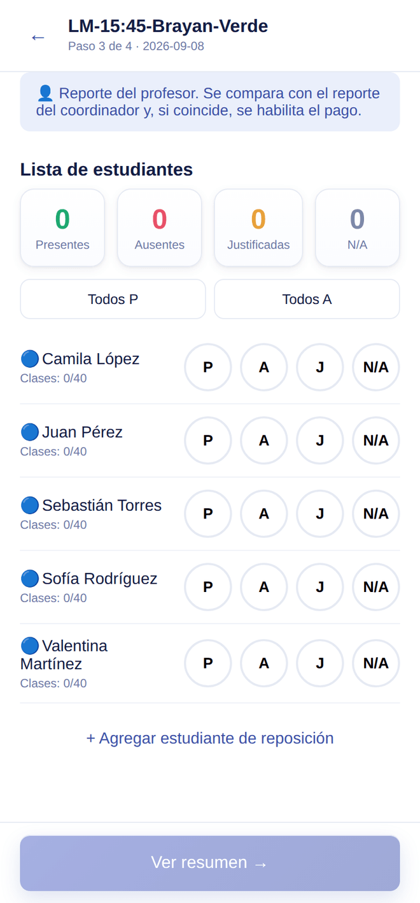

* **J** opens an optional free-text justification. This text is *deliberately not compared*
  between the two reports.
* **N/A** is for students who bought fewer classes than the group's weekly days: it counts
  neither as attendance nor as absence, does not consume the package, does not pay the
  professor, and removes one expected class from the attendance alerts.
* `+ Agregar estudiante de reposición` adds a visitor (individual make-up) or creates a
  **trial student** (🧪) on the spot, with duplicate protection by normalised name.

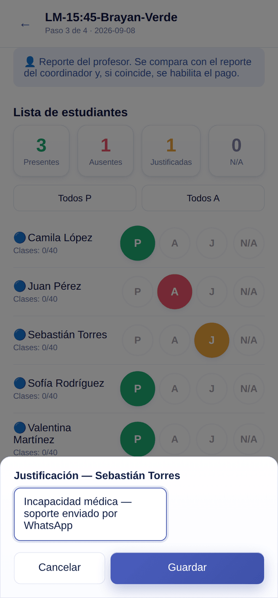
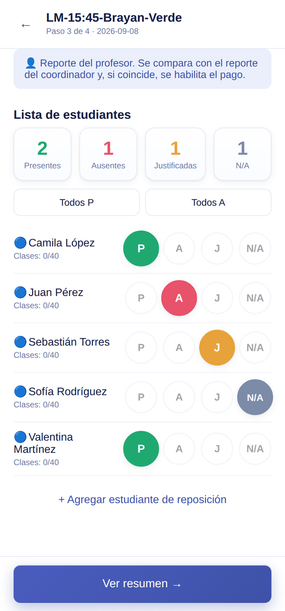

### Step 4 — Summary and payment preview

Visible to ADMIN, SUPERADMIN and TEACHER only — **the coordinator never sees amounts**,
neither here nor anywhere else. The preview mirrors the cost engine:
bracket rate by number of students present (1–2 → `rate_2_students`, 3 → `rate_3_students`,
4 → `rate_4_students`, 5+ → `rate_5plus_students`) × units, plus the assistant's fixed rate.
A red warning appears if the report is late.

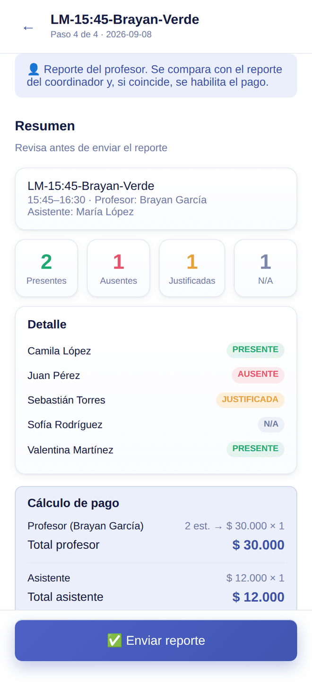

---

## 4. Validation of a regular class: the double report

`POST /api/sessions/:id/finalize` **does not write attendance**. It writes the caller's own
draft (`ClassReport` + `ClassReportAttendance`) and then runs `consolidateSession()`.

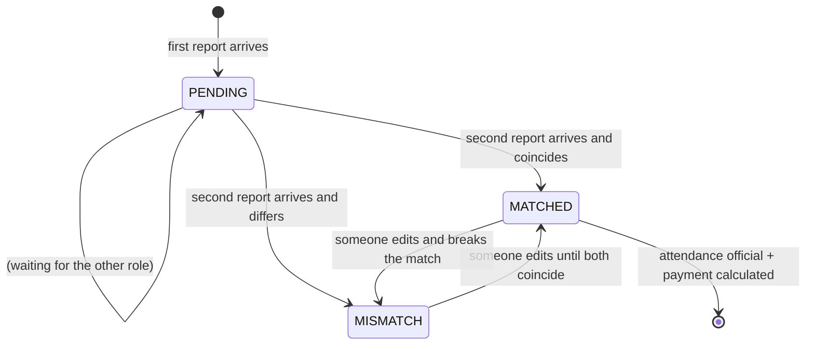
```mermaid
stateDiagram-v2
    [*] --> PENDING: first report arrives
    PENDING --> PENDING: (waiting for the other role)
    PENDING --> MATCHED: second report arrives and coincides
    PENDING --> MISMATCH: second report arrives and differs
    MISMATCH --> MATCHED: someone edits until both coincide
    MATCHED --> MISMATCH: someone edits and breaks the match
    MATCHED --> [*]: attendance official + payment calculated
```

### What the three states do

| State | Attendance records | Cost records | Session status | What the user sees |
|---|---|---|---|---|
| `PENDING` | none | none | `PROGRAMADA` | 🕓 "Falta el reporte del coordinador/profesor" |
| `MATCHED` | written from the professor's report | calculated | `REALIZADA` | ✅ "Reportes coinciden… pago habilitado" |
| `MISMATCH` | **deleted** | **deleted** | back to `PROGRAMADA` | ⚠️ conflict + banner + `/admin/conflicts` |

### What is compared (`diffReports`)

1. **Every student's status**, P/A/J/N-A, as an exact string, over the union of both rosters.
2. **The effective teacher**: the titular when `dictatedByOwner`, otherwise the substitute.
3. **The assistant** (or the absence of one).

Not compared: the justification text, and the free-text note.

### The sequence, role by role

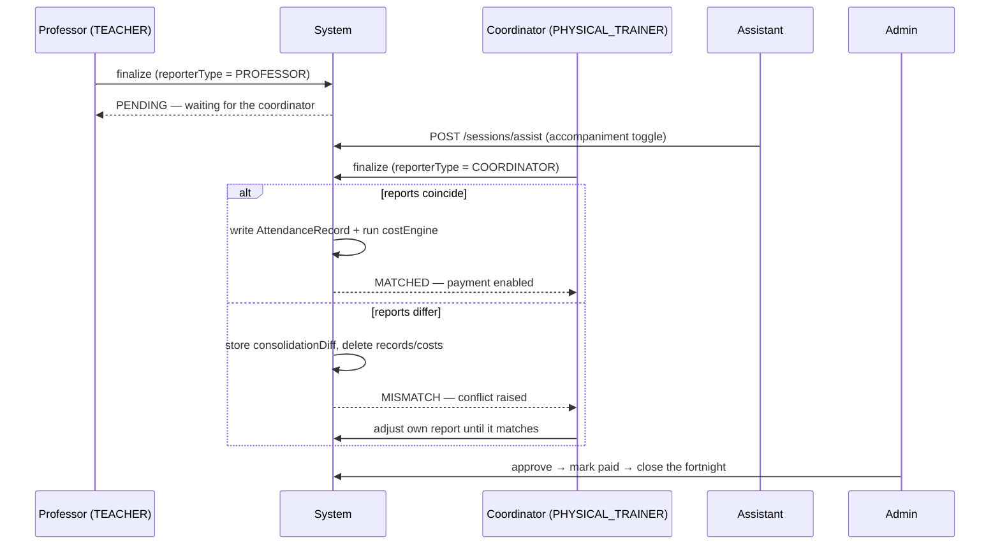
```mermaid
sequenceDiagram
    participant P as Professor (TEACHER)
    participant S as System
    participant C as Coordinator (PHYSICAL_TRAINER)
    participant A as Assistant
    participant AD as Admin

    P->>S: finalize (reporterType = PROFESSOR)
    S-->>P: PENDING — waiting for the coordinator
    A->>S: POST /sessions/assist (accompaniment toggle)
    C->>S: finalize (reporterType = COORDINATOR)
    alt reports coincide
        S->>S: write AttendanceRecord + run costEngine
        S-->>C: MATCHED — payment enabled
    else reports differ
        S->>S: store consolidationDiff, delete records/costs
        S-->>C: MISMATCH — conflict raised
        C->>S: adjust own report until it matches
    end
    AD->>S: approve → mark paid → close the fortnight
```

**A single report is submitted first — nothing is official yet:**

**The other role opens the same class.** Step 1 is skipped (the session already exists) and
the flow starts at step 2, writing the *other* report:

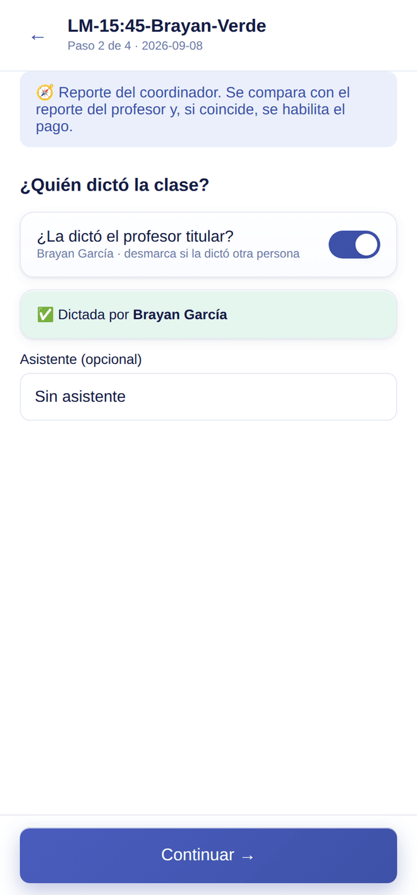

**If they differ** the class is *not* consolidated, and both are told immediately:

The conflict is surfaced as a red banner in the dashboard of both the professor and the
coordinator, and as a page listing exactly which student diverges and what each side said:

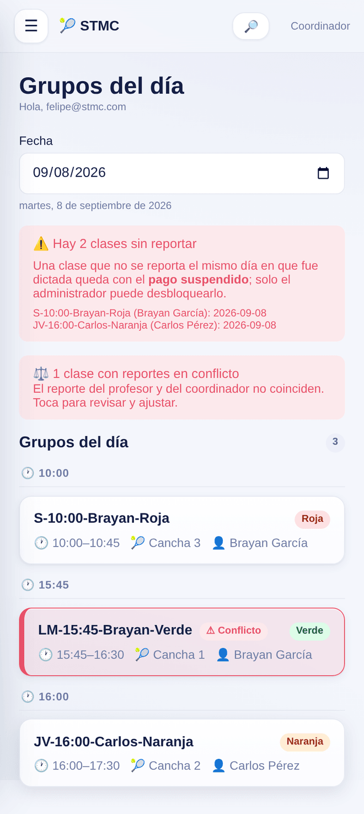
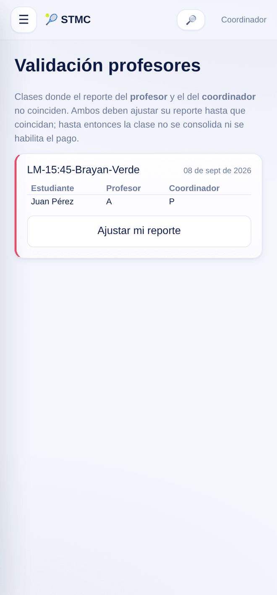

> **Edge case handled explicitly:** if the divergent student was moved out of the group
> between the two reports, the conflicts page annotates *"📤 ya no en el grupo (date)"*
> (read from `StudentGroupHistory`) and the roster shows a **✕ quitar** button, so the two
> reports can converge.

**Correcting a report is just re-entering the flow.** The system detects that this user's own
report exists, prefills it completely (attendance, assistant, who taught) and jumps to step 3
with an *"Editando reporte"* banner. The previous version is snapshotted into `SessionEditLog`.

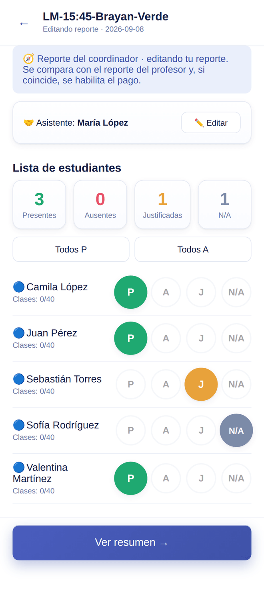

**When both coincide**, attendance becomes official and the cost engine runs:

---

## 5. The assistant, and the triple coincidence

An assistant **never reports attendance**. In their day view they toggle the classes they
accompanied. This works even if nobody has reported the class yet: the toggle creates the
session (`PROGRAMADA`) carrying only the assistant's confirmation, and the professor's and
coordinator's reports later reuse it.

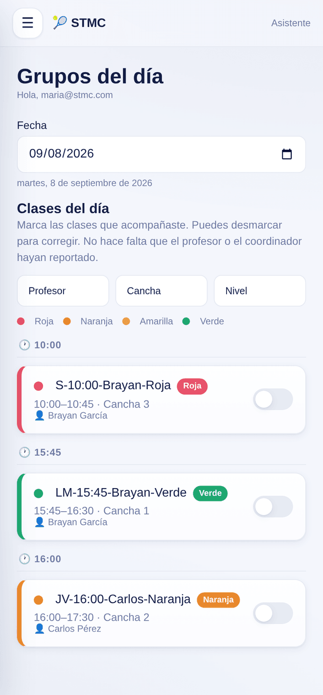

* `POST /api/sessions/assist` — regular classes, addressed by **group + date**.
* `POST /api/sessions/:id/assist` — make-ups, addressed by session id.
* `remove: true` un-marks a mistake (and deletes the session if it was auto-created and empty).
* A class has **one** assistant: trying to overwrite another assistant's confirmation returns `409`.
* Blocked with `409` if the fortnight is already closed.

The assistant's own payment is only enabled by the **triple coincidence** — the three
declarations must point to the same person:

| Leg | Field | Who writes it | When |
|---|---|---|---|
| Professor | `ClassSession.assistantId` (from the professor's report) | TEACHER | Step 2 of the flow |
| Assistant | `assistantConfirmedId` / `assistantConfirmedAt` | ASSISTANT | Toggle in the day view |
| Coordinator | `coordinatorValidatedAt`, **or** an implicit agreement | COORDINATOR / ADMIN | See below |

**Everything that coincides is validated automatically.** There is no manual click when the
system can already prove the agreement:

* **Regular class**: a `MATCHED` consolidation *is* the coordinator's agreement — professor
  and coordinator already coincided on the assistant. Only the assistant's own confirmation
  is still needed.
* **Make-up**: assigning the assistant when creating the make-up stamps `coordinatorValidated*`
  right there. If the professor later reports a *different* assistant, that stamp is cleared
  and the case returns to the manual queue.
* `POST /api/sessions/:id/validate-assistant` remains the manual path (make-ups reported by a
  teacher, legacy sessions, overrides).
* Sessions dated before `assistant_match_start_date` (a `SystemConfig` cut-off) stay `PAYABLE`.

The assistant sees the state of each class in colour — blue *registered*, yellow *pending*,
green **✓ Habilitada para pago**:

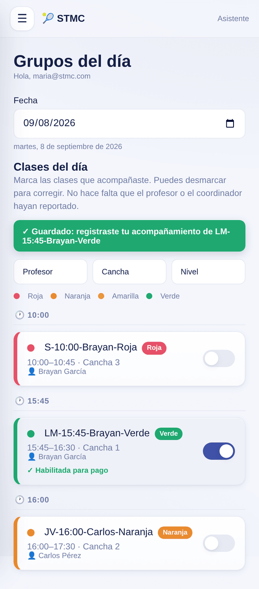

The coordinator works the queue at `/admin/validation`, per fortnight. It shows the three
declarations side by side and names **exactly what is missing** (`professor`,
`assistant`, `assistant_mismatch`, `coordinator`) — the same function that the payroll uses,
so both screens always agree.

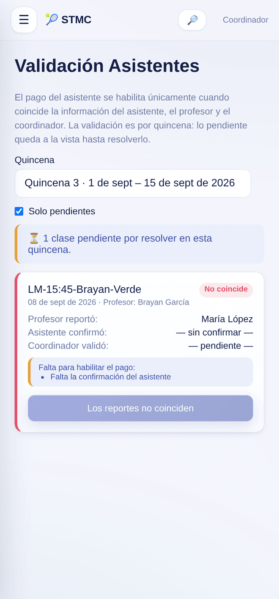
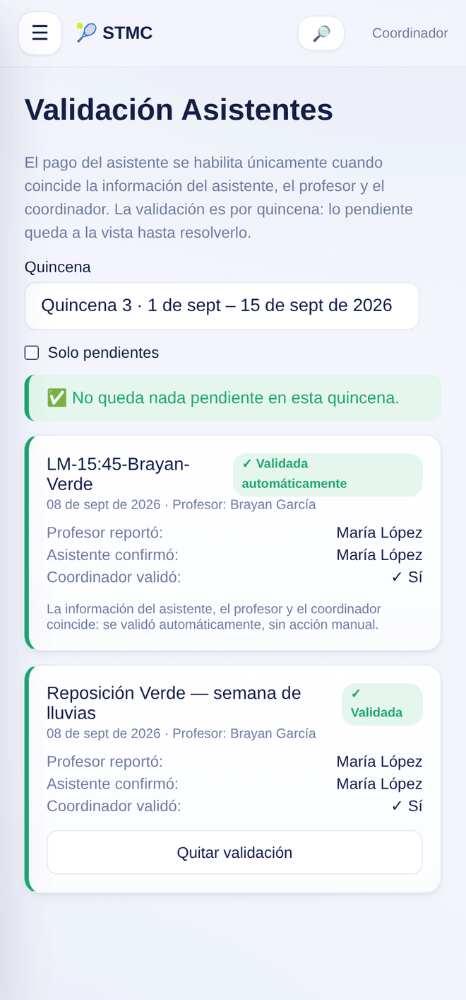

Until the three coincide, the assistant's `CostRecord` stays `PENDING_MATCH` and is excluded
from the payable total.

---

## 6. Time rules: same-day reporting and the closed fortnight

| Rule | Mechanism | Who can override |
|---|---|---|
| **Report the same day.** A class first reported after its own date (America/Bogotá) suspends the professor's pay: `payStatus = SUSPENDED_LATE`. | `firstReportedAt` is stamped by the **first** report of *either* role and never re-stamped, so correcting a report does not re-suspend it. Sessions with `firstReportedAt = null` (historical data) are never late. | ADMIN only — `POST /api/sessions/:id/unlock-payment`, from the payroll page |
| **Pending classes are visible.** | `GET /api/alerts/pending-reports` — red banner on the dashboard. A class counts as reported *for me* when my own report exists; for management, when both coincide. | — |
| **A closed fortnight is frozen.** No report, cancellation, accompaniment, make-up edit or unlock is accepted for a period with `PayrollClosure.locked` (`409`). | `isSessionPeriodLocked()` | ADMIN — `POST /api/payroll/reopen` |
| **Suspended amounts are carried over.** On closing, `SUSPENDED_LATE` records move to the next fortnight with `carriedFromPeriod`. | `POST /api/payroll/close` | — |

---

## 7. Make-up classes (reposiciones)

A make-up is a `ClassSession` with `kind = MAKEUP` and **no group**. It is the one flow where
the coordinator declares everything up front, so a **single** report is enough.

### 7.1 The coordinator creates it — `POST /api/makeups` (ADMIN / Coordinador)

Required: date, professor, at least one student, and **how many attendances it is worth**
(`countsAsUnits`: *Sencilla = 1*, *Doble = 2*). Optional: title and assistant.
Participants are stored as `MakeupParticipant`; there is no roster to derive.

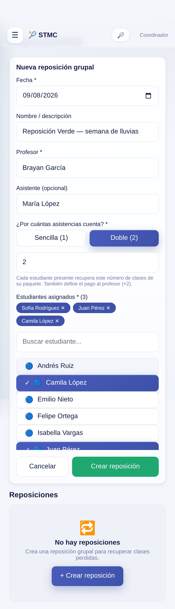
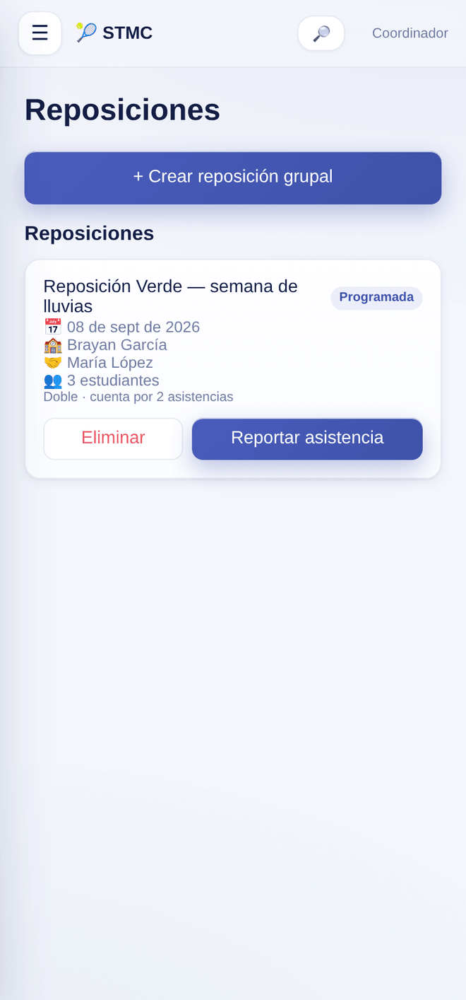

> Assigning the assistant here stamps `coordinatorValidatedById/At` immediately — the
> coordinator has already declared their leg of the triple coincidence.

### 7.2 It reaches the people who need it, on their own screens

* **Professor** — the make-up appears on their dashboard, split into
  **"Reposiciones por reportar"** (date ≤ today, with the late-report warning) and
  **"Próximas reposiciones"** (informative).
* **Assistant** — it appears in *"🔁 Reposiciones del día"* with the same accompaniment
  toggle, including on days excluded from the semester, where there are no regular classes.
* `GET /api/sessions` excludes make-ups by default (`kind=REGULAR`), so they never pollute
  the regular-class views.

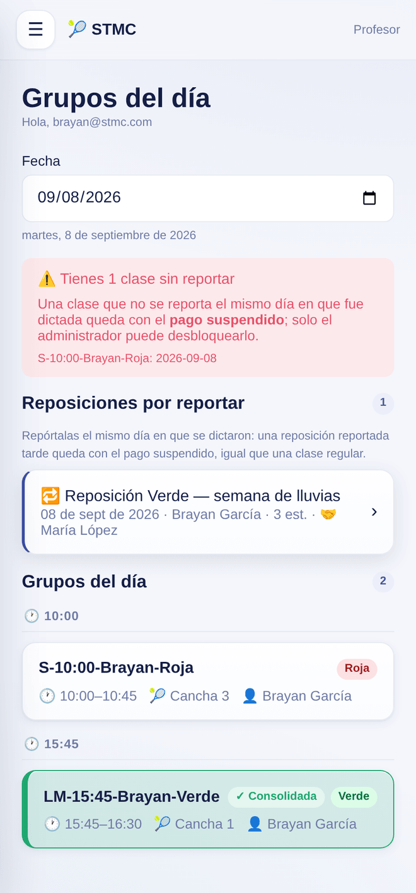

### 7.3 The report — `POST /api/makeups/:id/finalize`

Who may report it: the **assigned professor** (or the substitute), or ADMIN / Coordinador.
The screen states the unit value, shows who the coordinator assigned as assistant, and warns
that changing that assistant sends the payment back to the validation queue.

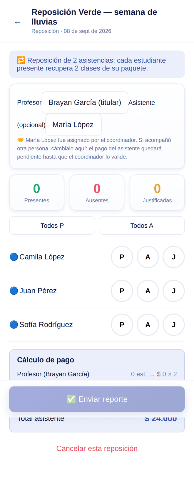

What the endpoint does, in one transaction of effects:

1. Replaces **all** `AttendanceRecord` of the session (the last report is the only truth).
   Every participant counts as `REGULAR` attendance — there is no separate make-up rate.
2. Sets `status = REALIZADA`, stamps `firstReportedAt` on the **first** report only.
3. Coordinator/admin reporting ⇒ re-stamps `coordinatorValidated*`.
   Teacher changing the assistant ⇒ clears it.
4. Writes a `SessionEditLog` if this was an edit of an already-reported make-up.
5. Runs the cost engine.

**There is no `PENDING`/`MATCHED` consolidation here** — a make-up has one report by design.

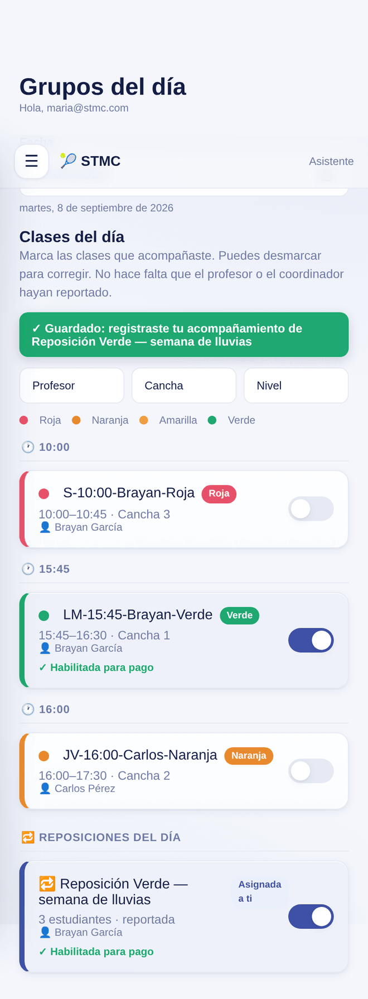

### 7.4 What a make-up is worth

| | Formula |
|---|---|
| Professor | `bracketRate(students present) × effectiveUnits` |
| Assistant | `assistant_fixed_rate × effectiveUnits` |
| Student's package | each present student consumes `effectiveUnits` classes (a *double* make-up consumes 2) |
| Attendance percentages | **not** weighted — one absence in a double make-up is still one absence |

Example from the screenshots: 3 students assigned, 2 present, *Doble* (units = 2) →
professor `30.000 × 2 = 60.000`, assistant `12.000 × 2 = 24.000`.

Editing the make-up (`PUT`), deleting it (`DELETE`) or cancelling it
(`POST /api/makeups/:id/cancel`, same structured categories) all recalculate or delete the
costs, and all respect the fortnight lock.

---

## 8. Where the money ends up

The attendance flow only *produces* `CostRecord`s. From there the admin drives a sequential
cycle — **Pendiente → Aprobado → Pagado** — per class and per beneficiary:

* Green (`PAYABLE`) can be approved; red (`PENDING_MATCH`, `SUSPENDED_LATE`) cannot.
* Nothing can be paid before it is approved.
* `POST /api/payroll/close` refuses to close while a `PAYABLE` record is still undecided,
  and freezes the period.

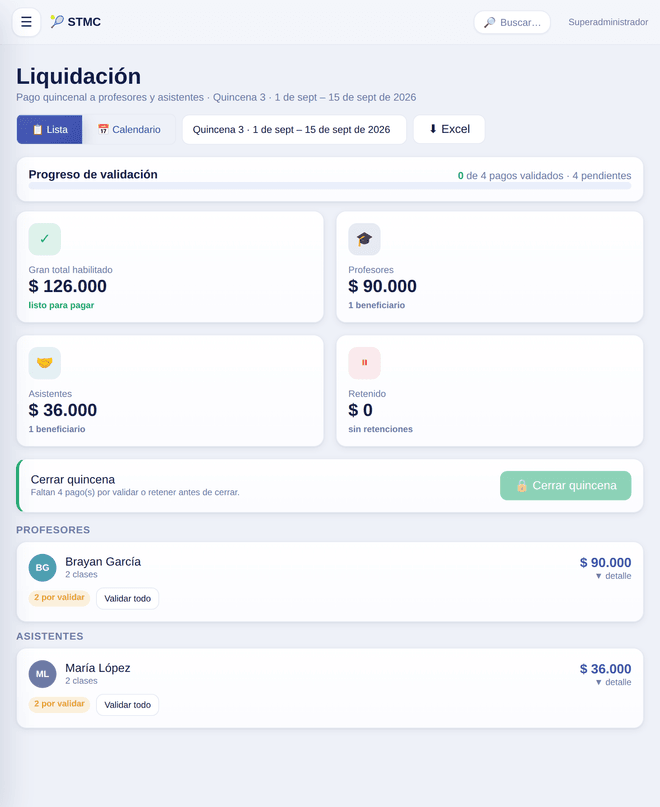

Professors and assistants see **only their own** figures in *Mi Quincena*, split into
pending / paid / withheld, plus the semester accumulated total.

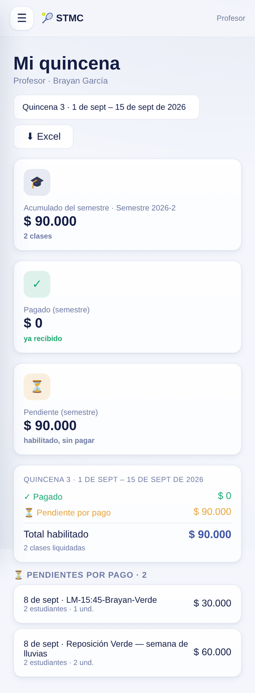

---

## 9. Who can do what — summary

| Action | TEACHER | Coordinador | ASSISTANT | ADMIN | SUPERADMIN |
|---|---|---|---|---|---|
| See the day's groups | own only | all | all (to mark accompaniment) | via reports | ✅ |
| Create the session / report a regular class | own groups (`PROFESSOR` report) | any group (`COORDINATOR` report) | ❌ | ❌ read-only | ✅ (states which report) |
| Cancel a regular class | own groups | any group | ❌ | ❌ | ✅ |
| Mark accompaniment | only if also registered as an assistant | idem | ✅ | on behalf of an assistant | ✅ |
| Create / edit / delete a make-up | ❌ | ✅ | ❌ | ✅ | ✅ |
| Report a make-up | only if assigned | ✅ | ❌ | ✅ | ✅ |
| Resolve report conflicts | own groups | all | ❌ | view only | ✅ |
| Validate the assistant match | ❌ | ✅ | ❌ | ✅ | ✅ |
| See amounts in the flow | own pay | ❌ never | own pay | ✅ | ✅ |
| Unlock a late payment · approve · pay · close | ❌ | ❌ | ❌ | ✅ | ✅ |

---

## 10. Endpoint reference

| Endpoint | Purpose |
|---|---|
| `GET /api/sessions/check?groupId&date` | Does a session exist? Returns both staging reports so the flow can prefill the caller's own draft |
| `POST /api/sessions` | Create/reuse the session (step 1, "class was held") |
| `POST /api/sessions/:id/finalize` | Save **my** report (`reporterType`) and run consolidation |
| `POST /api/sessions/:id/cancel` | Structured cancellation; deletes cost records |
| `POST /api/sessions/assist` | Assistant accompaniment by group + date (`remove` to undo) |
| `POST /api/sessions/:id/assist` | Same, for a make-up |
| `POST /api/sessions/:id/validate-assistant` | Manual coordinator validation |
| `GET /api/sessions/validation-queue` | The validation queue with the three declarations and what is missing |
| `POST /api/sessions/:id/unlock-payment` | ADMIN unlocks a payment suspended for late reporting |
| `GET /api/alerts/pending-reports` | Classes not reported yet (per role) |
| `GET /api/alerts/report-conflicts` | Classes in `MISMATCH`, with the diff and the "left the group" annotation |
| `GET/POST/PUT/DELETE /api/makeups[/:id]` | Make-up lifecycle |
| `POST /api/makeups/:id/finalize` · `/cancel` | Report / cancel a make-up |
| `GET /api/reports/class/:sessionId` | Full class report: both drafts, consolidation state, edit history |

### Relevant database fields

`ClassSession`: `kind`, `status`, `consolidationStatus`, `consolidationDiff`, `consolidatedAt`,
`firstReportedAt`, `paymentUnlockedAt/ById`, `dictatedByOwner`, `notDictatedNote`,
`substituteProfessorId`, `assistantId`, `assistantConfirmedId/At`,
`coordinatorValidatedById/At`, `effectiveUnits`, `cancellationCategory/Reason`.
`ClassReport`: `@@unique([sessionId, reporterType])`.
`CostRecord.payStatus`: `PAYABLE` · `SUSPENDED_LATE` · `PENDING_MATCH`.

---

## 11. Note on an outdated line in `CLAUDE.md`

The role table in `CLAUDE.md` still shows *"Tomar asistencia: ADMIN ✅ · PARENT solo su hijo"*.
That is no longer what the code does. Since the double-report phase, `canReportGroup()`
(`server/src/routes/sessions.js`) accepts **only** `TEACHER`, `PHYSICAL_TRAINER` and
`SUPERADMIN`; ADMIN is read-only on attendance and PARENT cannot report at all — and the
route `/attendance/:groupId` is restricted to the same roles in `App.jsx`. Note 32 of the same
file describes the current behaviour correctly; the table above it was not updated.
