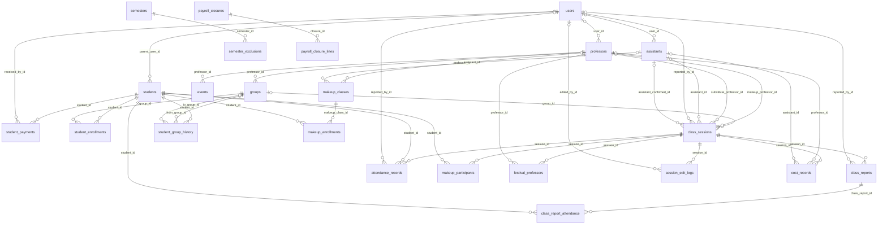

# Database Dictionary — AsisteciaSTMC

> **Generated file — do not edit by hand.** It is produced from `server/src/services/dataDictionary.js` by `cd server && npm run docs:dictionary`. The same module feeds the *Data Dictionary* sheet of the full database export, so the document and the exported workbook always describe the same schema. A unit test (`tests/unit/dataDictionary.test.js`) fails if `schema.prisma` gains, renames or drops anything that is not documented here.

**Engine:** PostgreSQL (Prisma ORM v5, versioned migrations) · **Tables:** 27 · **Enums:** 14 · **Columns:** 247

## Conventions

- **Names.** Prisma models are `PascalCase`, physical tables and columns are `snake_case` (the `@@map` / `@map` of the schema). This document lists the *physical* names — what you see in SQL and in the export.
- **Primary keys.** Every entity uses a `cuid` text id generated by the application, never a database sequence. Join tables use a composite key of the two foreign keys.
- **Soft delete.** Rows are not deleted: `active = false` plus `deactivation_reason` / `deactivated_at`. Hard deletes exist only behind explicit admin actions.
- **Dates.** `date` columns are calendar days in America/Bogota (no time zone attached); `timestamp` columns are instants stored in UTC.
- **Money.** All amounts are Colombian pesos (COP) in `numeric(12,2)`.
- **Fortnights.** Payroll periods are text: `"YYYY-MM-1"` (days 1–15) and `"YYYY-MM-2"` (16 to end of month).
- **Derived state.** Student status (trial / pre-enrolled / enrolled / fully paid / suspended / inactive) and attendance statistics are computed on the server from payments, attendance and rates. They are not stored — do not look for a status column.

## Table index

**Identity & access**

| Table | Model | Purpose |
|---|---|---|
| [`users`](#users) | `User` | Login accounts. |

**People**

| Table | Model | Purpose |
|---|---|---|
| [`professors`](#professors) | `Professor` | Teaching staff. |
| [`assistants`](#assistants) | `Assistant` | Assistants who accompany classes. |
| [`students`](#students) | `Student` | Students of the academy. |

**Money in**

| Table | Model | Purpose |
|---|---|---|
| [`student_payments`](#student_payments) | `StudentPayment` | Payments made by a student, registered by reception/admin. |

**Catalogue**

| Table | Model | Purpose |
|---|---|---|
| [`groups`](#groups) | `Group` | Class groups: weekly schedule, court, level and owner professor. |
| [`student_enrollments`](#student_enrollments) | `StudentEnrollment` | Membership of a student in a group. |
| [`semesters`](#semesters) | `Semester` | Academic semesters. |
| [`semester_exclusions`](#semester_exclusions) | `SemesterExclusion` | Dates excluded from a semester (public holidays, breaks). |
| [`system_config`](#system_config) | `SystemConfig` | Key/value configuration. |

**Classes**

| Table | Model | Purpose |
|---|---|---|
| [`class_sessions`](#class_sessions) | `ClassSession` | A class on a given date. |
| [`class_reports`](#class_reports) | `ClassReport` | Staging report of one side of the dual report. |
| [`class_report_attendance`](#class_report_attendance) | `ClassReportAttendance` | Attendance mark of one student inside one staging report. |
| [`attendance_records`](#attendance_records) | `AttendanceRecord` | Consolidated attendance — the single source of truth for reports, statistics and the cost engine. |
| [`makeup_participants`](#makeup_participants) | `MakeupParticipant` | Students assigned to a group make-up or to a festival. |
| [`festival_professors`](#festival_professors) | `FestivalProfessor` | Professors taking part in a festival. |

**Audit**

| Table | Model | Purpose |
|---|---|---|
| [`session_edit_logs`](#session_edit_logs) | `SessionEditLog` | Audit trail of edits to an already filed attendance report. |
| [`student_group_history`](#student_group_history) | `StudentGroupHistory` | History of group changes of a student. |
| [`payroll_logs`](#payroll_logs) | `PayrollLog` | Audit trail of every payroll action on a period: closings, reopenings, approvals, holds, payments and carry-overs.. |

**Payroll**

| Table | Model | Purpose |
|---|---|---|
| [`cost_records`](#cost_records) | `CostRecord` | Money owed for one session to one payee. |
| [`payroll_closures`](#payroll_closures) | `PayrollClosure` | Closing of a fortnight. |
| [`payroll_closure_lines`](#payroll_closure_lines) | `PayrollClosureLine` | Frozen snapshot of one payee inside a closing: how many classes, how much was paid and how much was carried over. |
| [`payroll_approvals`](#payroll_approvals) | `PayrollApproval` | Legacy single approval per fortnight, superseded by the per-class approval flow and the closing *(legacy)*. |

**Other**

| Table | Model | Purpose |
|---|---|---|
| [`events`](#events) | `Event` | Tournaments and clinics with a flat fee for the professor in charge.. |
| [`enrollment_requests`](#enrollment_requests) | `EnrollmentRequest` | Submissions of the public enrollment form *(legacy)*. |
| [`makeup_classes`](#makeup_classes) | `MakeupClass` | Legacy make-up model *(legacy)*. |
| [`makeup_enrollments`](#makeup_enrollments) | `MakeupEnrollment` | Students of a legacy make-up class *(legacy)*. |

## Relationships

Foreign keys declared in the schema (crow’s foot points at the many side).

## Identity & access

### `users`

*Prisma model:* `User` · *area:* Identity & access · *columns:* 8

Login accounts. One row per person who can sign in. Professors, assistants and parents are linked to their domain row (professors / assistants / students.parent_user_id). Deactivating a user (active = false) revokes access on the very next request, without waiting for the JWT to expire.

| Column | Type | Null | Key | Description |
|---|---|---|---|---|
| `id` | text | no | PK | Primary key. Collision-free id generated by the application (cuid). |
| `email` | text | no | UQ | Login email. Unique across the system. |
| `password_hash` | text | no |  | bcrypt hash of the password (10 rounds on creation, 12 on change). Never leaves the server: redacted in every export. **Redacted in exports.** |
| `role` | Role | no |  | Access level. Default TEACHER. |
| `active` | boolean | no |  | Soft delete. false = account blocked. Default true. |
| `policies_accepted_at` | timestamp | yes |  | When the user accepted the academy policies (blocking modal on the parent portal). |
| `created_at` | timestamp | no |  | Row creation timestamp. |
| `updated_at` | timestamp | no |  | Last update, maintained by Prisma. |

**PK:** (id) · **Unique:** (email)

**Relations**

- `professor` → `Professor` — Professor profile of this account, if any.
- `assistant` → `Assistant` — Assistant profile of this account, if any.
- `parentOf` → `Student[]` — Children linked to this guardian account.
- `reportedSessions` → `ClassSession[]` — Sessions whose last report was filed by this user.
- `reportedAttendance` → `AttendanceRecord[]` — Consolidated attendance rows attributed to this user.
- `sessionEdits` → `SessionEditLog[]` — Report edits made by this user.
- `classReports` → `ClassReport[]` — Staging reports filed by this user.
- `paymentsReceived` → `StudentPayment[]` — Student payments registered by this user.

## People

### `professors`

*Prisma model:* `Professor` · *area:* People · *columns:* 5

Teaching staff. A professor may exist without a login account; linking one (user_id) lets them report their own groups and see their own payroll.

| Column | Type | Null | Key | Description |
|---|---|---|---|---|
| `id` | text | no | PK | Primary key. Collision-free id generated by the application (cuid). |
| `user_id` | text | yes | FK → users.id (UQ) | Login account of this professor, if created. Unique. |
| `name` | text | no |  | Full name shown across the app. |
| `active` | boolean | no |  | Soft delete. Default true. |
| `created_at` | timestamp | no |  | Row creation timestamp. |

**PK:** (id) · **Unique:** (user_id)

**Relations**

- `groups` → `Group[]` — Groups where this professor is the owner.
- `substitutedSessions` → `ClassSession[]` — Sessions taught as a substitute.
- `makeupSessions` → `ClassSession[]` — Make-up sessions assigned to this professor.
- `festivalSessions` → `FestivalProfessor[]` — Festivals this professor took part in.
- `costRecords` → `CostRecord[]` — Payroll rows owed to this professor.
- `events` → `Event[]` — Tournaments/clinics assigned to this professor.

### `assistants`

*Prisma model:* `Assistant` · *area:* People · *columns:* 5

Assistants who accompany classes. Paid a fixed rate per class, released only when the triple match (assistant, professor, coordinator) agrees.

| Column | Type | Null | Key | Description |
|---|---|---|---|---|
| `id` | text | no | PK | Primary key. Collision-free id generated by the application (cuid). |
| `user_id` | text | yes | FK → users.id (UQ) | Login account of this assistant, if created. Unique. |
| `name` | text | no |  | Full name. |
| `active` | boolean | no |  | Soft delete. Default true. |
| `created_at` | timestamp | no |  | Row creation timestamp. |

**PK:** (id) · **Unique:** (user_id)

**Relations**

- `sessions` → `ClassSession[]` — Sessions where the professor declared this assistant.
- `confirmedSessions` → `ClassSession[]` — Sessions this assistant confirmed having accompanied.
- `costRecords` → `CostRecord[]` — Payroll rows owed to this assistant.

### `students`

*Prisma model:* `Student` · *area:* People · *columns:* 22

Students of the academy. The commercial status (trial / pre-enrolled / enrolled / fully paid / suspended / inactive) is NOT stored: it is derived on the server from payments, attendance and the tuition rates. classes_acquired + previous_classes is the size of the package the student may consume.

| Column | Type | Null | Key | Description |
|---|---|---|---|---|
| `id` | text | no | PK | Primary key. Collision-free id generated by the application (cuid). |
| `name` | text | no |  | Full name. |
| `email` | text | yes |  | Contact email (guardian). |
| `document` | text | yes |  | National id document. Used as the key of the public data-validation flow. |
| `phone` | text | yes |  | Contact phone / WhatsApp. |
| `guardian_name` | text | yes |  | Guardian name. |
| `birth_date` | date | yes |  | Date of birth. Drives the tuition category (adult from tuition_adult_age, child below). A regular active student without it is flagged with a data error. |
| `parent_user_id` | text | yes | FK → users.id | Guardian account that can see this student in the parent portal. |
| `classes_start_date` | date | yes |  | Day the student starts (or started) classes. Floor for the expected classes in the attendance alerts; absences before it do not count. |
| `is_trial` | boolean | no |  | Trial class: prospect created from the attendance flow with only a name and no groups. Default false. |
| `classes_acquired` | integer | no |  | Classes bought for the current semester. Basis of the expected tuition amount. Default 0. |
| `previous_classes` | integer | no |  | Classes carried over from the previous semester. Added to the available package but NOT to the tuition owed (already paid). Default 0. |
| `payment_complete` | boolean | no |  | Legacy manual flag. Unused — the paid status is derived from student_payments. |
| `suspended_from` | date | yes |  | Start of a temporary suspension. |
| `suspended_until` | date | yes |  | End of the suspension. While inside the window the student disappears from the rosters and reappears automatically afterwards. |
| `suspension_reason` | text | yes |  | Reason of the suspension (required when suspending). |
| `active` | boolean | no |  | Soft delete. Default true. |
| `deactivation_reason` | text | yes |  | Reason given when deactivating (required). |
| `deactivated_at` | timestamp | yes |  | When the student was deactivated. |
| `validated_at` | timestamp | yes |  | When the guardian confirmed the contact data through the public validation page. |
| `policies_accepted_at` | timestamp | yes |  | When the guardian accepted the policies for this student. |
| `created_at` | timestamp | no |  | Row creation timestamp. |

**PK:** (id)

**Relations**

- `parentUser` → `User` — Guardian account.
- `enrollments` → `StudentEnrollment[]` — Groups the student belongs to.
- `attendanceRecords` → `AttendanceRecord[]` — Consolidated attendance history.
- `classReportAttendance` → `ClassReportAttendance[]` — Marks in the staging reports.
- `makeupParticipations` → `MakeupParticipant[]` — Make-up / festival sessions the student was assigned to.
- `groupHistory` → `StudentGroupHistory[]` — Group transfers.
- `payments` → `StudentPayment[]` — Payments received.

## Money in

### `student_payments`

*Prisma model:* `StudentPayment` · *area:* Money in · *columns:* 12

Payments made by a student, registered by reception/admin. Independent history: it does not mutate any status column — the "fully paid" state is derived by comparing the accumulated amount against the expected tuition. Verification (verified_at) is the accounting reconciliation against the bank statement or the cash count.

| Column | Type | Null | Key | Description |
|---|---|---|---|---|
| `id` | text | no | PK | Primary key. Collision-free id generated by the application (cuid). |
| `student_id` | text | no | FK → students.id | Student who paid. |
| `payment_date` | date | no |  | Date the money was received. |
| `method` | PaymentMethod | no |  | Payment method. |
| `amount` | numeric(12,2) | no |  | Amount in COP. |
| `received_by_id` | text | yes | FK → users.id | User who registered the payment. |
| `received_by_name` | text | yes |  | Name of that user, frozen at registration time. |
| `note` | text | yes |  | Free note. |
| `verified_at` | timestamp | yes |  | When the payment was reconciled by an admin. |
| `verified_by_id` | text | yes |  | User who verified it. |
| `verified_by_name` | text | yes |  | Name of the verifier, frozen. |
| `created_at` | timestamp | no |  | Row creation timestamp. |

**PK:** (id) · **Index:** (student_id)

**Relations**

- `student` → `Student` — Payer.
- `receivedBy` → `User` — Who registered it.

## Catalogue

### `groups`

*Prisma model:* `Group` · *area:* Catalogue · *columns:* 23

Class groups: weekly schedule, court, level and owner professor. The seven weekday booleans are the calendar used to derive the expected sessions of a semester.

| Column | Type | Null | Key | Description |
|---|---|---|---|---|
| `id` | text | no | PK | Primary key. Collision-free id generated by the application (cuid). |
| `code` | text | no | UQ | Unique human code of the group (e.g. "G12"). Sorted alphanumerically across the app. |
| `name` | text | yes |  | Optional descriptive name. |
| `professor_id` | text | no | FK → professors.id | Owner professor. Defines who may report this group. |
| `lunes` | boolean | no |  | Meets on Monday. Default false. |
| `martes` | boolean | no |  | Meets on Tuesday. Default false. |
| `miercoles` | boolean | no |  | Meets on Wednesday. Default false. |
| `jueves` | boolean | no |  | Meets on Thursday. Default false. |
| `viernes` | boolean | no |  | Meets on Friday. Default false. |
| `sabado` | boolean | no |  | Meets on Saturday. Default false. |
| `domingo` | boolean | no |  | Meets on Sunday. Default false. |
| `start_time` | text | no |  | Start time as "HH:MM". |
| `end_time` | text | no |  | End time as "HH:MM". |
| `duration_minutes` | integer | no |  | Length of the class in minutes. |
| `class_units` | numeric(3,1) | no |  | Legacy weight of a class. Always 1.0 since double groups were removed; kept for historical rows. |
| `court` | integer | yes |  | Court number. |
| `ball_level` | text | yes |  | Level: Roja / Naranja / Verde / Amarilla / Intermedio / Avanzado. |
| `sub_level` | text | yes |  | Informative sub-level A/B/C (only for the four colour levels). |
| `capacity` | integer | no |  | Maximum number of students (occupancy base). Default 8. |
| `active` | boolean | no |  | Soft delete. Default true. |
| `deactivation_reason` | text | yes |  | Reason given when deactivating (required). |
| `deactivated_at` | timestamp | yes |  | When the group was deactivated. |
| `created_at` | timestamp | no |  | Row creation timestamp. |

**PK:** (id) · **Unique:** (code)

**Relations**

- `professor` → `Professor` — Owner professor.
- `enrollments` → `StudentEnrollment[]` — Students of the group.
- `sessions` → `ClassSession[]` — Class sessions of the group.
- `historyFrom / historyTo` → `StudentGroupHistory[]` — Transfers out of / into this group.

### `student_enrollments`

*Prisma model:* `StudentEnrollment` · *area:* Catalogue · *columns:* 4

Membership of a student in a group. Composite primary key (student, group): a student can belong to several groups, one of them PRIMARY.

| Column | Type | Null | Key | Description |
|---|---|---|---|---|
| `student_id` | text | no | PK, FK → students.id | Student. |
| `group_id` | text | no | PK, FK → groups.id | Group. |
| `enrollment_type` | EnrollmentType | no |  | PRIMARY or SECONDARY. Default PRIMARY. |
| `enrolled_at` | timestamp | no |  | Enrollment date. Floor for the expected classes of this student in this group. |

**PK:** (student_id, group_id)

**Relations**

- `student` → `Student`
- `group` → `Group`

### `semesters`

*Prisma model:* `Semester` · *area:* Catalogue · *columns:* 6

Academic semesters. Exactly one may be active: activating one deactivates the rest. The active semester scopes the statistics, alerts and the strategic dashboard.

| Column | Type | Null | Key | Description |
|---|---|---|---|---|
| `id` | text | no | PK | Primary key. Collision-free id generated by the application (cuid). |
| `name` | text | no |  | Display name (e.g. "Semestre 2026-1"). |
| `start_date` | date | no |  | First day of the semester. |
| `end_date` | date | no |  | Last day of the semester. |
| `active` | boolean | no |  | Only one active semester at a time. Default false. |
| `created_at` | timestamp | no |  | Row creation timestamp. |

**PK:** (id)

**Relations**

- `exclusions` → `SemesterExclusion[]` — Dates with no classes.

### `semester_exclusions`

*Prisma model:* `SemesterExclusion` · *area:* Catalogue · *columns:* 5

Dates excluded from a semester (public holidays, breaks). Removed from the expected class calendar of every group.

| Column | Type | Null | Key | Description |
|---|---|---|---|---|
| `id` | text | no | PK | Primary key. Collision-free id generated by the application (cuid). |
| `semester_id` | text | no | FK → semesters.id | Semester. |
| `date` | date | no |  | Excluded date. |
| `reason` | text | yes |  | Reason (e.g. "Festivo"). |
| `created_at` | timestamp | no |  | Row creation timestamp. |

**PK:** (id)

**Relations**

- `semester` → `Semester`

### `system_config`

*Prisma model:* `SystemConfig` · *area:* Catalogue · *columns:* 4

Key/value configuration. Holds the pay brackets (rate_2_students … rate_5plus_students), the fixed assistant rate, the tuition plan (tuition_adult_total, tuition_child_total, tuition_plan_classes, tuition_adult_age), the rain alert threshold and the start date of the assistant triple-match rule.

| Column | Type | Null | Key | Description |
|---|---|---|---|---|
| `key` | text | no | PK | Configuration key. |
| `value` | text | no |  | Value, stored as text and parsed by the consumer. |
| `updated_at` | timestamp | no |  | Last change. |
| `updated_by` | text | yes |  | Who changed it. |

**PK:** (key)

## Classes

### `class_sessions`

*Prisma model:* `ClassSession` · *area:* Classes · *columns:* 27

A class on a given date. Three kinds share this table: REGULAR (a group class), MAKEUP (group make-up, no group_id, participants in makeup_participants) and FESTIVAL (several professors, flat rate each). The unique constraint (group_id, date) prevents duplicated sessions for a group on the same day. A regular session only becomes REALIZADA when the professor and the coordinator reports match.

| Column | Type | Null | Key | Description |
|---|---|---|---|---|
| `id` | text | no | PK | Primary key. Collision-free id generated by the application (cuid). |
| `group_id` | text | yes | FK → groups.id | Group of a REGULAR session. Null for make-ups and festivals. |
| `kind` | SessionKind | no |  | REGULAR / MAKEUP / FESTIVAL. Default REGULAR. |
| `title` | text | yes |  | Title of a make-up or festival. |
| `makeup_professor_id` | text | yes | FK → professors.id | Professor assigned to a make-up. |
| `date` | date | no |  | Date of the class (America/Bogota). |
| `status` | SessionStatus | no |  | Lifecycle state. Default PROGRAMADA. |
| `effective_units` | numeric(3,1) | no |  | How many attendances this session is worth. 1.0 for every regular class; configurable for make-ups. |
| `cancellation_reason` | text | yes |  | Free-text reason, required when the category is OTRA. |
| `cancellation_category` | CancellationCategory | yes |  | Structured cancellation reason. |
| `dictated_by_owner` | boolean | no |  | false = the owner professor did not teach it. Default true. |
| `not_dictated_note` | text | yes |  | Mandatory note when dictated_by_owner is false. |
| `substitute_professor_id` | text | yes | FK → professors.id | Professor who actually taught, if not the owner. |
| `assistant_id` | text | yes | FK → assistants.id | Assistant declared in the consolidated report. |
| `reported_by_id` | text | yes | FK → users.id | User of the last report. |
| `first_reported_at` | timestamp | yes |  | Timestamp of the FIRST report, whoever filed it. Reporting after the class day suspends the pay; editing later never re-suspends. Null on historical rows, which are therefore never late. |
| `payment_unlocked_by_id` | text | yes |  | ADMIN who released a late-report suspension. |
| `payment_unlocked_at` | timestamp | yes |  | When the suspension was released. |
| `assistant_confirmed_id` | text | yes | FK → assistants.id | Assistant who confirmed having accompanied the class (their own claim). |
| `assistant_confirmed_at` | timestamp | yes |  | When the assistant confirmed. |
| `coordinator_validated_by_id` | text | yes |  | Coordinator/admin who validated the assistant. Stamped automatically when their own report is the source. |
| `coordinator_validated_at` | timestamp | yes |  | When the assistant was validated. |
| `festival_rate` | numeric(12,2) | yes |  | Flat amount paid to EACH professor of a festival. |
| `consolidation_status` | ConsolidationStatus | no |  | PENDING / MATCHED / MISMATCH of the dual report. Default PENDING. |
| `consolidation_diff` | jsonb | yes |  | Detail of the disagreement per student when the status is MISMATCH. |
| `consolidated_at` | timestamp | yes |  | When both reports matched. |
| `created_at` | timestamp | no |  | Row creation timestamp. |

**PK:** (id) · **Unique:** (group_id, date)

**Relations**

- `group` → `Group` — Group of a regular session.
- `makeupProfessor / substituteProfessor` → `Professor` — Professors of a make-up or substitution.
- `assistant / assistantConfirmed` → `Assistant` — Declared vs. self-confirmed assistant.
- `reports` → `ClassReport[]` — The two staging reports.
- `attendanceRecords` → `AttendanceRecord[]` — Consolidated attendance (source of truth).
- `makeupParticipants` → `MakeupParticipant[]` — Participants of a make-up/festival.
- `festivalProfessors` → `FestivalProfessor[]` — Professors of a festival.
- `costRecords` → `CostRecord[]` — Money generated by this session.
- `editLogs` → `SessionEditLog[]` — Audit of report edits.

### `class_reports`

*Prisma model:* `ClassReport` · *area:* Classes · *columns:* 10

Staging report of one side of the dual report. At most two rows per session (PROFESSOR and COORDINATOR). Deleted in cascade with the session. When both agree the consolidation writes attendance_records and enables the pay.

| Column | Type | Null | Key | Description |
|---|---|---|---|---|
| `id` | text | no | PK | Primary key. Collision-free id generated by the application (cuid). |
| `session_id` | text | no | FK → class_sessions.id | Session being reported. ON DELETE CASCADE. |
| `reporter_type` | ClassReporterType | no | UQ | PROFESSOR or COORDINATOR. Unique together with session_id. |
| `reported_by_id` | text | yes | FK → users.id | User who filed it. |
| `dictated_by_owner` | boolean | no |  | Whether this report says the owner taught the class. Compared between both reports. Default true. |
| `dictating_professor_id` | text | yes |  | Professor this report says taught the class. Loose id (no FK): staging data compared by identity only. |
| `not_dictated_note` | text | yes |  | Mandatory note when the owner did not teach. |
| `assistant_id` | text | yes |  | Assistant declared in this report. Compared between both reports. |
| `submitted_at` | timestamp | no |  | First submission of this report. |
| `updated_at` | timestamp | no |  | Last edit of this report. |

**PK:** (id) · **Unique:** (session_id, reporter_type)

**Relations**

- `session` → `ClassSession`
- `reportedBy` → `User`
- `attendance` → `ClassReportAttendance[]` — Marks per student of this report.

### `class_report_attendance`

*Prisma model:* `ClassReportAttendance` · *area:* Classes · *columns:* 6

Attendance mark of one student inside one staging report. The consolidation compares status and attendance type student by student; the justification text is deliberately NOT compared.

| Column | Type | Null | Key | Description |
|---|---|---|---|---|
| `id` | text | no | PK | Primary key. Collision-free id generated by the application (cuid). |
| `class_report_id` | text | no | FK → class_reports.id | Report this mark belongs to. ON DELETE CASCADE. |
| `student_id` | text | no | FK → students.id (UQ) | Student. Unique together with the report. |
| `status` | AttendanceStatus | no |  | P / A / J / N-A as reported by this side. |
| `attendance_type` | AttendanceType | no |  | REGULAR or REPOSICION. Default REGULAR. |
| `justification` | text | yes |  | Reason of an excused absence. Carried to the consolidated record; never compared. |

**PK:** (id) · **Unique:** (class_report_id, student_id)

**Relations**

- `report` → `ClassReport`
- `student` → `Student`

### `attendance_records`

*Prisma model:* `AttendanceRecord` · *area:* Classes · *columns:* 8

Consolidated attendance — the single source of truth for reports, statistics and the cost engine. Written only when both reports match (or directly for make-ups and festivals). One row per session and student.

| Column | Type | Null | Key | Description |
|---|---|---|---|---|
| `id` | text | no | PK | Primary key. Collision-free id generated by the application (cuid). |
| `session_id` | text | no | FK → class_sessions.id | Session. |
| `student_id` | text | no | FK → students.id (UQ) | Student. Unique together with the session. |
| `status` | AttendanceStatus | no |  | Final mark. |
| `attendance_type` | AttendanceType | no |  | REGULAR or REPOSICION. Default REGULAR. |
| `justification` | text | yes |  | Reason of an excused absence. |
| `reported_by_id` | text | yes | FK → users.id | User whose report produced this row. |
| `created_at` | timestamp | no |  | Row creation timestamp. |

**PK:** (id) · **Unique:** (session_id, student_id)

**Relations**

- `session` → `ClassSession`
- `student` → `Student`
- `reportedBy` → `User`

### `makeup_participants`

*Prisma model:* `MakeupParticipant` · *area:* Classes · *columns:* 2

Students assigned to a group make-up or to a festival. Composite key (session, student); deleted in cascade with the session.

| Column | Type | Null | Key | Description |
|---|---|---|---|---|
| `session_id` | text | no | PK, FK → class_sessions.id | Make-up / festival session. |
| `student_id` | text | no | PK, FK → students.id | Participant. |

**PK:** (session_id, student_id)

**Relations**

- `session` → `ClassSession`
- `student` → `Student`

### `festival_professors`

*Prisma model:* `FestivalProfessor` · *area:* Classes · *columns:* 2

Professors taking part in a festival. Each one earns the session festival_rate (equal pay). Composite key (session, professor).

| Column | Type | Null | Key | Description |
|---|---|---|---|---|
| `session_id` | text | no | PK, FK → class_sessions.id | Festival session. |
| `professor_id` | text | no | PK, FK → professors.id | Participating professor. |

**PK:** (session_id, professor_id)

**Relations**

- `session` → `ClassSession`
- `professor` → `Professor`

## Audit

### `session_edit_logs`

*Prisma model:* `SessionEditLog` · *area:* Audit · *columns:* 6

Audit trail of edits to an already filed attendance report. Keeps the whole previous and new state as JSON, shown in Reports → Class.

| Column | Type | Null | Key | Description |
|---|---|---|---|---|
| `id` | text | no | PK | Primary key. Collision-free id generated by the application (cuid). |
| `session_id` | text | no | FK → class_sessions.id | Edited session. |
| `edited_by_id` | text | yes | FK → users.id | User who edited. |
| `edited_at` | timestamp | no |  | When the edit happened. |
| `previous_state` | jsonb | yes |  | Snapshot before the edit. |
| `new_state` | jsonb | yes |  | Snapshot after the edit. |

**PK:** (id)

**Relations**

- `session` → `ClassSession`
- `editedBy` → `User`

### `student_group_history`

*Prisma model:* `StudentGroupHistory` · *area:* Audit · *columns:* 8

History of group changes of a student. Also used to explain report conflicts caused by a transfer that happened between the two reports.

| Column | Type | Null | Key | Description |
|---|---|---|---|---|
| `id` | text | no | PK | Primary key. Collision-free id generated by the application (cuid). |
| `student_id` | text | no | FK → students.id | Student. |
| `from_group_id` | text | yes | FK → groups.id | Origin group. |
| `to_group_id` | text | yes | FK → groups.id | Destination group. |
| `action_type` | text | no |  | TRANSFER \| ADD_GROUP \| REMOVE_GROUP. |
| `reason` | text | yes |  | Reason of the change. |
| `changed_by_id` | text | yes |  | User who made the change. |
| `changed_at` | timestamp | no |  | When it happened. |

**PK:** (id)

**Relations**

- `student` → `Student`
- `fromGroup / toGroup` → `Group`

### `payroll_logs`

*Prisma model:* `PayrollLog` · *area:* Audit · *columns:* 7

Audit trail of every payroll action on a period: closings, reopenings, approvals, holds, payments and carry-overs.

| Column | Type | Null | Key | Description |
|---|---|---|---|---|
| `id` | text | no | PK | Primary key. Collision-free id generated by the application (cuid). |
| `period` | text | no |  | Fortnight the action refers to. |
| `action` | PayrollLogAction | no |  | Action performed. |
| `actor_id` | text | yes |  | User who performed it. |
| `actor_name` | text | yes |  | Name of that user, frozen. |
| `at` | timestamp | no |  | When it happened. |
| `detail` | jsonb | yes |  | Extra payload (affected ids, totals). |

**PK:** (id)

## Payroll

### `cost_records`

*Prisma model:* `CostRecord` · *area:* Payroll · *columns:* 19

Money owed for one session to one payee. Produced by the cost engine when a session is consolidated: professor = bracket rate by present students × effective units; assistant = fixed rate × units; festival = flat rate per participating professor. professor_id and assistant_id are mutually exclusive (payee_type decides which one is set). Flow: pay_status PAYABLE → approved_at (validated) → paid_at (paid); held_at excludes the row from the payout.

| Column | Type | Null | Key | Description |
|---|---|---|---|---|
| `id` | text | no | PK | Primary key. Collision-free id generated by the application (cuid). |
| `session_id` | text | no | FK → class_sessions.id | Session that generated the cost. |
| `professor_id` | text | yes | FK → professors.id | Payee when payee_type = PROFESSOR. |
| `assistant_id` | text | yes | FK → assistants.id | Payee when payee_type = ASSISTANT. |
| `payee_type` | PayeeType | no |  | Which of the two id columns is in use. |
| `present_count` | integer | no |  | Present students used to pick the bracket. Default 0. |
| `effective_units` | numeric(3,1) | no |  | Units of the session at the time of the calculation. |
| `rate` | numeric(12,2) | no |  | Applied rate: flat bracket amount per session (professor), fixed rate (assistant) or festival rate. |
| `total` | numeric(12,2) | no |  | rate × effective units. Amount owed in COP. |
| `period` | text | no |  | Fortnight the class belongs to, as "YYYY-MM-1" (days 1-15) or "YYYY-MM-2" (16-end). |
| `pay_status` | PayStatus | no |  | PAYABLE / SUSPENDED_LATE / PENDING_MATCH. Default PAYABLE. |
| `approved_at` | timestamp | yes |  | When an admin validated the row for payment. Required before paying. |
| `approved_by_id` | text | yes |  | Admin who validated it. |
| `held_at` | timestamp | yes |  | When the row was held back, excluding it from the payout. |
| `held_by_id` | text | yes |  | Admin who held it. |
| `paid_at` | timestamp | yes |  | When the money was actually handed over. |
| `paid_by_id` | text | yes |  | Admin who marked it as paid. |
| `carried_from_period` | text | yes |  | Set when a suspended row was carried over from an earlier fortnight during a closing. |
| `created_at` | timestamp | no |  | Row creation timestamp. |

**PK:** (id)

**Relations**

- `session` → `ClassSession`
- `professor` → `Professor`
- `assistant` → `Assistant`

### `payroll_closures`

*Prisma model:* `PayrollClosure` · *area:* Payroll · *columns:* 8

Closing of a fortnight. One row per period. While locked = true no report or cost of that period can be edited (the guard answers 409). Reopening unlocks it but does not undo the carry-overs.

| Column | Type | Null | Key | Description |
|---|---|---|---|---|
| `id` | text | no | PK | Primary key. Collision-free id generated by the application (cuid). |
| `period` | text | no | UQ | Fortnight, e.g. "2026-08-1". Unique. |
| `closed_by_id` | text | yes |  | Admin who closed it. |
| `closed_by_name` | text | yes |  | Name of that admin, frozen. |
| `closed_at` | timestamp | no |  | When it was closed. |
| `reopened_by_id` | text | yes |  | Admin who reopened it. |
| `reopened_at` | timestamp | yes |  | When it was reopened. |
| `locked` | boolean | no |  | true = period frozen. Default true. |

**PK:** (id) · **Unique:** (period)

**Relations**

- `lines` → `PayrollClosureLine[]` — Frozen totals per payee.

### `payroll_closure_lines`

*Prisma model:* `PayrollClosureLine` · *area:* Payroll · *columns:* 9

Frozen snapshot of one payee inside a closing: how many classes, how much was paid and how much was carried over. Deleted in cascade with the closure.

| Column | Type | Null | Key | Description |
|---|---|---|---|---|
| `id` | text | no | PK | Primary key. Collision-free id generated by the application (cuid). |
| `closure_id` | text | no | FK → payroll_closures.id | Closing this line belongs to. ON DELETE CASCADE. |
| `payee_type` | PayeeType | no |  | PROFESSOR or ASSISTANT. |
| `payee_id` | text | no |  | Id of the professor or assistant (loose id, no FK: it is a snapshot). |
| `payee_name` | text | yes |  | Name frozen at closing time. |
| `class_count` | integer | no |  | Classes included. Default 0. |
| `total_paid` | numeric(12,2) | no |  | Amount settled in this period. Default 0. |
| `total_carried` | numeric(12,2) | no |  | Amount carried over to the next period. Default 0. |
| `snapshot` | jsonb | yes |  | Raw detail of the lines at closing time. |

**PK:** (id)

**Relations**

- `closure` → `PayrollClosure`

### `payroll_approvals`

*Prisma model:* `PayrollApproval` · *area:* Payroll · *columns:* 8 · **legacy — kept for historical rows only**

Legacy single approval per fortnight, superseded by the per-class approval flow and the closing. Kept for historical rows.

| Column | Type | Null | Key | Description |
|---|---|---|---|---|
| `id` | text | no | PK | Primary key. Collision-free id generated by the application (cuid). |
| `period` | text | no | UQ | Fortnight. Unique. |
| `approved_by_id` | text | yes |  | Admin who approved. |
| `approved_by_name` | text | yes |  | Name of that admin, frozen. |
| `total_payable` | numeric(12,2) | no |  | Payable total at approval time. Default 0. |
| `total_retained` | numeric(12,2) | no |  | Retained total at approval time. Default 0. |
| `note` | text | yes |  | Free note. |
| `approved_at` | timestamp | no |  | When it was approved. |

**PK:** (id) · **Unique:** (period)

## Other

### `events`

*Prisma model:* `Event` · *area:* Other · *columns:* 8

Tournaments and clinics with a flat fee for the professor in charge.

| Column | Type | Null | Key | Description |
|---|---|---|---|---|
| `id` | text | no | PK | Primary key. Collision-free id generated by the application (cuid). |
| `name` | text | no |  | Event name. |
| `date` | date | no |  | Date of the event. |
| `professor_id` | text | no | FK → professors.id | Professor in charge. |
| `fixed_rate` | numeric(12,2) | no |  | Flat fee in COP. |
| `description` | text | yes |  | Description. |
| `active` | boolean | no |  | Soft delete. Default true. |
| `created_at` | timestamp | no |  | Row creation timestamp. |

**PK:** (id)

**Relations**

- `professor` → `Professor`

### `enrollment_requests`

*Prisma model:* `EnrollmentRequest` · *area:* Other · *columns:* 14 · **legacy — kept for historical rows only**

Submissions of the public enrollment form. Superseded by the data-validation flow, kept for the historical requests.

| Column | Type | Null | Key | Description |
|---|---|---|---|---|
| `id` | text | no | PK | Primary key. Collision-free id generated by the application (cuid). |
| `student_name` | text | no |  | Student name as typed by the applicant. |
| `birth_date` | date | yes |  | Date of birth. |
| `parent_name` | text | yes |  | Guardian name. |
| `email` | text | no |  | Contact email. |
| `phone` | text | yes |  | Contact phone. |
| `eps` | text | yes |  | Health provider. |
| `payment_date` | date | yes |  | Declared payment date. |
| `payment_proof` | text | yes |  | Payment proof (long text / data URL). |
| `notes` | text | yes |  | Free notes. |
| `preferred_group_id` | text | yes |  | Requested main group. |
| `preferred_secondary_group_id` | text | yes |  | Requested secondary group. |
| `status` | text | no |  | PENDING \| APPROVED \| REJECTED. Default PENDING. |
| `submitted_at` | timestamp | no |  | Submission timestamp. |

**PK:** (id)

### `makeup_classes`

*Prisma model:* `MakeupClass` · *area:* Other · *columns:* 9 · **legacy — kept for historical rows only**

Legacy make-up model. Group make-ups now live in class_sessions with kind = MAKEUP; this table is kept for historical rows only.

| Column | Type | Null | Key | Description |
|---|---|---|---|---|
| `id` | text | no | PK | Primary key. Collision-free id generated by the application (cuid). |
| `date` | date | no |  | Date of the make-up. |
| `type` | MakeupType | no |  | INDIVIDUAL or GRUPAL. |
| `professor_id` | text | yes | FK → professors.id | Professor. |
| `assistant_id` | text | yes | FK → assistants.id | Assistant. |
| `student_count` | integer | no |  | Number of students. Default 0. |
| `description` | text | yes |  | Description. |
| `created_by` | text | yes |  | Who created it. |
| `created_at` | timestamp | no |  | Row creation timestamp. |

**PK:** (id)

**Relations**

- `professor` → `Professor`
- `assistant` → `Assistant`
- `enrollments` → `MakeupEnrollment[]`

### `makeup_enrollments`

*Prisma model:* `MakeupEnrollment` · *area:* Other · *columns:* 2 · **legacy — kept for historical rows only**

Students of a legacy make-up class. Composite key (makeup class, student).

| Column | Type | Null | Key | Description |
|---|---|---|---|---|
| `makeup_class_id` | text | no | PK, FK → makeup_classes.id | Legacy make-up class. |
| `student_id` | text | no | PK, FK → students.id | Student. |

**PK:** (makeup_class_id, student_id)

**Relations**

- `makeupClass` → `MakeupClass`
- `student` → `Student`

## Enums

### `Role`

Access level of a user account.

| Value | Meaning |
|---|---|
| `SUPERADMIN` | Top role, strict superset of ADMIN. Only role allowed to create ADMIN/SUPERADMIN accounts, wipe class data and export the database. |
| `ADMIN` | Full management: payroll, accounting, configuration, catalogue. Read-only on attendance reports. |
| `TEACHER` | Professor. Reports attendance for the groups they own and sees their own pay. |
| `ASSISTANT` | Assistant. Confirms the classes they accompanied and sees their own pay. |
| `PARENT` | Guardian. Read-only portal for their own children. |
| `PHYSICAL_TRAINER` | Shown as "Coordinador" in the UI. Operational management without access to money. |
| `RECEPTION` | Front desk: creates/edits students and registers their payments. |

### `PaymentMethod`

How a student payment was received.

| Value | Meaning |
|---|---|
| `TRANSFERENCIA` | Bank transfer. |
| `EFECTIVO` | Cash. |
| `WOMPI` | Wompi payment gateway. |
| `BOLD` | Bold payment gateway. |

### `EnrollmentType`

Weight of a student ↔ group link.

| Value | Meaning |
|---|---|
| `PRIMARY` | Main group of the student. |
| `SECONDARY` | Additional group. |

### `SessionKind`

Nature of a class session.

| Value | Meaning |
|---|---|
| `REGULAR` | Ordinary class of a group (has group_id, dual report applies). |
| `MAKEUP` | Group make-up class (no group_id; participants in makeup_participants). |
| `FESTIVAL` | Festival: several professors, flat equal pay per professor. |

### `SessionStatus`

Lifecycle state of a class session.

| Value | Meaning |
|---|---|
| `PROGRAMADA` | Scheduled — not reported yet (or waiting for the second report). |
| `REALIZADA` | Taught and consolidated. Only this state (and the legacy half state) generates cost records. |
| `CANCELADA` | Cancelled, with a structured reason. |
| `CANCELADA_MITAD` | Legacy "half cancelled" state of the removed double-class model. No longer produced. |

### `CancellationCategory`

Structured reason why a session was cancelled.

| Value | Meaning |
|---|---|
| `LLUVIA` | Rain. Counted by the rain alert per group. |
| `SIN_ESTUDIANTES` | No students showed up. |
| `OTRA` | Other — free-text reason required. |

### `ClassReporterType`

Which side of the dual report a staging report belongs to.

| Value | Meaning |
|---|---|
| `PROFESSOR` | Report filed by the teacher. |
| `COORDINATOR` | Report filed by the coordinator (PHYSICAL_TRAINER). |

### `ConsolidationStatus`

Result of comparing the professor report against the coordinator report.

| Value | Meaning |
|---|---|
| `PENDING` | Only one of the two reports has arrived. No attendance, no cost yet. |
| `MATCHED` | Both reports agree → attendance_records written, session set to REALIZADA, pay enabled. |
| `MISMATCH` | Reports disagree → conflict alert; attendance and costs are removed until both converge. |

### `AttendanceStatus`

Attendance mark of a student in one session.

| Value | Meaning |
|---|---|
| `PRESENTE` | Present. Consumes one class of the package and counts towards the professor pay bracket. |
| `AUSENTE` | Absent. Only counts as a used class in festivals, and only from the student class start date. |
| `JUSTIFICADA` | Excused absence. Never counts as a used class. |
| `NO_APLICA` | Not applicable: the student bought fewer days than the group meets. Counts neither as attendance nor absence and subtracts one expected class in the alerts. |

### `AttendanceType`

Whether the student belongs to the session roster or is catching up.

| Value | Meaning |
|---|---|
| `REGULAR` | Student of the group (or assigned participant of a make-up/festival). |
| `REPOSICION` | Student added to this session as a make-up. |

### `PayeeType`

Who is paid by a cost record.

| Value | Meaning |
|---|---|
| `PROFESSOR` | Professor — bracket rate by number of present students. |
| `ASSISTANT` | Assistant — fixed rate per class. |

### `PayStatus`

Whether a cost record can be paid.

| Value | Meaning |
|---|---|
| `PAYABLE` | Enabled for payment. |
| `SUSPENDED_LATE` | Held because the class was reported after its own day. Only an ADMIN can unlock it; on closing it is carried over to the next period. |
| `PENDING_MATCH` | Assistant pay waiting for the triple match (assistant + professor + coordinator). |

### `MakeupType`

Legacy make-up class shape (superseded by class_sessions with kind = MAKEUP).

| Value | Meaning |
|---|---|
| `INDIVIDUAL` | One-to-one make-up. |
| `GRUPAL` | Group make-up. |

### `PayrollLogAction`

Audited action on a payroll period.

| Value | Meaning |
|---|---|
| `CLOSE` | Period closed and locked. |
| `REOPEN` | Period unlocked again. |
| `MARK_PAID` | A cost record was marked as paid. |
| `UNMARK_PAID` | The paid mark was removed. |
| `UNLOCK_LATE` | A late-report suspension was released by an ADMIN. |
| `CARRY_OVER` | Suspended records moved to the next period during the closing. |
| `APPROVE` | A cost record was validated for payment. |
| `UNAPPROVE` | The validation was withdrawn. |
| `HOLD` | A cost record was held back and excluded from the payout. |
| `UNHOLD` | The hold was released. |
| `BULK_APPROVE` | Bulk validation. |
| `BULK_UNAPPROVE` | Bulk withdrawal of validation. |
| `BULK_HOLD` | Bulk hold. |
| `BULK_PAY` | Bulk payment mark. |

## Exporting the data

An ADMIN or SUPERADMIN can download the whole database from **Configuración → Base de datos**:

- **Excel** (`GET /api/system/export/database?format=xlsx`) — one sheet per table plus an *Overview* sheet with the row counts, this dictionary as a *Data Dictionary* sheet and an *Enums* sheet.
- **JSON** (`GET /api/system/export/database?format=json`) — the same content as a logical backup, keyed by physical table name.

Columns marked as sensitive (today only `users.password_hash`) are replaced by `[REDACTED]` in both formats: password hashes never leave the server. The export is a *data* dump, not a `pg_dump`; to restore a server, take a PostgreSQL backup instead.
