# Esquema de Aplicación Web - Sistema de Asistencia de Tenis

## 🏗️ Arquitectura General

### Stack Tecnológico
- **Frontend:** React.js + Vite
- **Styling:** Tailwind CSS
- **Estado:** React Context + useReducer
- **Almacenamiento Local:** localStorage (sincronización offline)
- **Backend:** Google Sheets API
- **Autenticación:** Google OAuth 2.0
- **Despliegue:** Netlify
- **Control de Versiones:** GitHub

---

## 📱 Estructura de Páginas y Componentes

### 1. Autenticación
```
/login
├── LoginPage.jsx
├── GoogleAuthButton.jsx
└── AuthContext.jsx
```

### 2. Dashboard Principal
```
/dashboard
├── DashboardPage.jsx
├── QuickStats.jsx
├── TodayClasses.jsx
└── NavigationMenu.jsx
```

### 3. Registro de Asistencia
```
/asistencia
├── AsistenciaPage.jsx
├── GroupSelector.jsx
├── StudentList.jsx
├── AttendanceForm.jsx
├── StudentCard.jsx
└── SubmitButton.jsx
```

### 4. Gestión de Clases
```
/clases
├── ClasesPage.jsx
├── ClassSchedule.jsx
├── CancelClassModal.jsx
├── CreateRepositionModal.jsx
└── ClassStatusCard.jsx
```

### 5. Reportes y Consultas
```
/reportes
├── ReportesPage.jsx
├── FilterPanel.jsx
├── ReportTable.jsx
├── ExportButton.jsx
├── MetricsCards.jsx
└── ChartComponents.jsx
```

### 6. Configuración
```
/configuracion
├── ConfiguracionPage.jsx
├── SyncStatus.jsx
├── UserProfile.jsx
└── SystemSettings.jsx
```

---

## 🎯 Flujos de Usuario Principales

### Flujo 1: Registro Diario de Asistencia

```mermaid
graph TD
    A[Login] --> B[Dashboard]
    B --> C[Seleccionar Asistencia]
    C --> D[Filtrar Grupos del Día]
    D --> E[Seleccionar Grupo]
    E --> F[Lista de Estudiantes]
    F --> G[Marcar Asistencias]
    G --> H[Agregar Justificaciones]
    H --> I[Guardar en Cache]
    I --> J[Enviar a Google Sheets]
    J --> K[Confirmación]
    
    J --> L[Error de Conexión]
    L --> M[Guardar Offline]
    M --> N[Sincronizar Automáticamente]
```


### Flujo 2: Cancelación de Clases

```mermaid
graph TD
    A[Dashboard/Clases] --> B[Ver Clases del Día]
    B --> C[Seleccionar Clase]
    C --> D[Cancelar Clase]
    D --> E[Seleccionar Motivo]
    E --> F[Confirmar Cancelación]
    F --> G[Actualizar Estado]
    G --> H[Notificar Sistema]
```


### Flujo 3: Creación de Reposiciones

```mermaid
graph TD
    A[Clases] --> B[Crear Reposición]
    B --> C[Seleccionar Fecha]
    C --> D[Elegir Estudiantes]
    D --> E[Asignar Profesor]
    E --> F[Definir Tipo]
    F --> G[Guardar Reposición]
    G --> H[Registrar Asistencia]
```


---

## 🛠️ Componentes Clave

### 1. AuthContext.jsx
```javascript
// Manejo global de autenticación
const AuthContext = createContext();

export const AuthProvider = ({ children }) => {
  const [user, setUser] = useState(null);
  const [loading, setLoading] = useState(true);
  
  // Funciones de login/logout
  // Verificación de tokens
  // Renovación automática
};
```

### 2. DataContext.jsx
```javascript
// Estado global de datos y sincronización
const DataContext = createContext();

export const DataProvider = ({ children }) => {
  const [grupos, setGrupos] = useState([]);
  const [estudiantes, setEstudiantes] = useState([]);
  const [asistencias, setAsistencias] = useState([]);
  const [connectionStatus, setConnectionStatus] = useState('online');
  
  // Funciones de sincronización
  // Cache management
  // Offline handling
};
```

### 3. GroupSelector.jsx
```javascript
const GroupSelector = ({ onGroupSelect, selectedDate }) => {
  // Filtrar grupos por día de la semana
  // Mostrar información del grupo
  // Permitir filtros adicionales (profesor, nivel)
  
  return (
    <div className="grid grid-cols-1 md:grid-cols-2 lg:grid-cols-3 gap-4">
      {filteredGroups.map(group => (
        <GroupCard key={group.codigo} group={group} onClick={onGroupSelect} />
      ))}
    </div>
  );
};
```

### 4. StudentList.jsx
```javascript
const StudentList = ({ groupCode, onAttendanceChange }) => {
  // Lista de estudiantes del grupo
  // Estados de asistencia individuales
  // Validaciones en tiempo real
  
  return (
    <div className="space-y-2">
      {students.map(student => (
        <StudentCard 
          key={student.id} 
          student={student} 
          onStatusChange={onAttendanceChange}
        />
      ))}
    </div>
  );
};
```

### 5. AttendanceForm.jsx
```javascript
const AttendanceForm = ({ groupCode, date }) => {
  // Formulario principal de asistencia
  // Manejo de estados local
  // Validaciones antes de envío
  // Sincronización offline
  
  const handleSubmit = async () => {
    try {
      await saveToGoogleSheets(attendanceData);
      showSuccess('Asistencia registrada correctamente');
    } catch (error) {
      saveToLocalStorage(attendanceData);
      showWarning('Guardado offline - se sincronizará automáticamente');
    }
  };
};
```

---

## 🔄 Gestión de Estado

### Estado Global (Context)
```javascript
// AuthContext
{
  user: { id, name, email, role },
  isAuthenticated: boolean,
  loading: boolean
}

// DataContext
{
  grupos: Array,
  estudiantes: Array,
  profesores: Array,
  asistencias: Array,
  connectionStatus: 'online' | 'offline' | 'syncing',
  lastSync: timestamp,
  pendingSync: Array
}

// UIContext
{
  currentPage: string,
  notifications: Array,
  modals: Object,
  filters: Object
}
```

### Estado Local (Componentes)
```javascript
// AttendanceForm
{
  selectedGroup: Object,
  attendanceList: Array,
  isDirty: boolean,
  validationErrors: Array
}

// ReportesPage
{
  filters: Object,
  reportData: Array,
  loading: boolean,
  exportFormat: string
}
```

---

## 📡 Integración con Google Sheets API

### 1. Configuración de API
```javascript
// googleSheetsAPI.js
export class GoogleSheetsAPI {
  constructor(spreadsheetId) {
    this.spreadsheetId = spreadsheetId;
    this.baseURL = 'https://sheets.googleapis.com/v4/spreadsheets';
  }
  
  async readRange(range) {
    // Leer datos de un rango específico
  }
  
  async appendData(range, values) {
    // Agregar nuevos registros
  }
  
  async updateData(range, values) {
    // Actualizar registros existentes
  }
}
```

### 2. Servicios de Datos
```javascript
// dataServices.js
export const DataService = {
  // Grupos
  async getGrupos() {
    return await api.readRange('Grupos!A:I');
  },
  
  // Estudiantes
  async getEstudiantes() {
    return await api.readRange('Estudiantes!A:F');
  },
  
  // Asistencias
  async saveAsistencia(attendanceData) {
    const values = formatAttendanceForSheets(attendanceData);
    return await api.appendData('Asistencias!A:J', [values]);
  },
  
  // Sincronización
  async syncPendingData() {
    const pending = getFromLocalStorage('pendingSync');
    for (const item of pending) {
      await this.saveAsistencia(item);
    }
    clearLocalStorage('pendingSync');
  }
};
```

---

## 🔒 Seguridad y Autenticación

### 1. Google OAuth 2.0
```javascript
// auth.js
export const AuthService = {
  async login() {
    const response = await gapi.auth2.getAuthInstance().signIn();
    const token = response.getAuthResponse().access_token;
    return this.validateUser(token);
  },
  
  async validateUser(token) {
    // Verificar permisos del usuario
    // Determinar rol (Asistente/Admin)
    // Establecer sesión
  },
  
  async refreshToken() {
    // Renovar token automáticamente
  }
};
```

### 2. Control de Acceso
```javascript
// ProtectedRoute.jsx
const ProtectedRoute = ({ children, requiredRole }) => {
  const { user, isAuthenticated } = useAuth();
  
  if (!isAuthenticated) {
    return <Navigate to="/login" />;
  }
  
  if (requiredRole && user.role !== requiredRole) {
    return <UnauthorizedPage />;
  }
  
  return children;
};
```

---

## 📱 Responsive Design y UX

### 1. Breakpoints (Tailwind CSS)
```css
/* Mobile First */
sm: 640px   /* Tablet */
md: 768px   /* Tablet Landscape */
lg: 1024px  /* Desktop */
xl: 1280px  /* Large Desktop */
```

### 2. Componentes Adaptativos
```javascript
// Optimizado para tablets (uso principal)
const ResponsiveGrid = ({ children }) => {
  return (
    <div className="
      grid 
      grid-cols-1 
      sm:grid-cols-2 
      lg:grid-cols-3 
      xl:grid-cols-4 
      gap-4 
      p-4
    ">
      {children}
    </div>
  );
};
```

### 3. Touch-Friendly Interface
```javascript
// Botones y elementos optimizados para touch
const TouchButton = ({ children, onClick }) => {
  return (
    <button 
      className="
        min-h-12 
        min-w-12 
        text-lg 
        rounded-lg 
        active:scale-95 
        transition-transform
      "
      onClick={onClick}
    >
      {children}
    </button>
  );
};
```

---

## 🔄 Funcionalidad Offline

### 1. Detección de Conexión
```javascript
// useOnlineStatus.js
export const useOnlineStatus = () => {
  const [isOnline, setIsOnline] = useState(navigator.onLine);
  
  useEffect(() => {
    const handleOnline = () => setIsOnline(true);
    const handleOffline = () => setIsOnline(false);
    
    window.addEventListener('online', handleOnline);
    window.addEventListener('offline', handleOffline);
    
    return () => {
      window.removeEventListener('online', handleOnline);
      window.removeEventListener('offline', handleOffline);
    };
  }, []);
  
  return isOnline;
};
```

### 2. Sincronización Automática
```javascript
// syncManager.js
export const SyncManager = {
  async syncWhenOnline() {
    const pendingData = getFromLocalStorage('pendingSync') || [];
    
    for (const item of pendingData) {
      try {
        await DataService.saveAsistencia(item);
        removePendingItem(item.id);
      } catch (error) {
        console.error('Error syncing:', error);
        break; // Detener si hay error
      }
    }
  },
  
  savePendingSync(data) {
    const pending = getFromLocalStorage('pendingSync') || [];
    pending.push({ ...data, id: generateUniqueId(), timestamp: Date.now() });
    saveToLocalStorage('pendingSync', pending);
  }
};
```

---

## 📊 Reportes y Análisis

### 1. Componentes de Filtrado
```javascript
// FilterPanel.jsx
const FilterPanel = ({ onFiltersChange }) => {
  const [filters, setFilters] = useState({
    dateRange: { start: '', end: '' },
    groups: [],
    professors: [],
    students: []
  });
  
  // UI para filtros dinámicos
  // Validaciones de rangos
  // Reset de filtros
};
```

### 2. Generación de Reportes
```javascript
// reportGenerator.js
export const ReportGenerator = {
  generateAttendanceReport(data, filters) {
    // Procesar datos según filtros
    // Calcular métricas
    // Formatear para exportación
  },
  
  exportToExcel(data, filename) {
    // Usar SheetJS para generar Excel
  },
  
  exportToPDF(data, filename) {
    // Generar PDF con jsPDF
  }
};
```

---

## ⚡ Optimización y Rendimiento

### 1. Lazy Loading
```javascript
// App.jsx
const AsistenciaPage = lazy(() => import('./pages/AsistenciaPage'));
const ReportesPage = lazy(() => import('./pages/ReportesPage'));

// Implementar Suspense para carga diferida
<Suspense fallback={<LoadingSpinner />}>
  <Routes>
    <Route path="/asistencia" element={<AsistenciaPage />} />
    <Route path="/reportes" element={<ReportesPage />} />
  </Routes>
</Suspense>
```

### 2. Memoización
```javascript
// Optimizar re-renders
const StudentCard = memo(({ student, onStatusChange }) => {
  // Componente solo se re-renderiza si student cambia
});

// Cachear cálculos pesados
const processedData = useMemo(() => {
  return heavyDataProcessing(rawData, filters);
}, [rawData, filters]);
```

### 3. Debouncing
```javascript
// useDebounce.js
export const useDebounce = (value, delay) => {
  const [debouncedValue, setDebouncedValue] = useState(value);
  
  useEffect(() => {
    const handler = setTimeout(() => {
      setDebouncedValue(value);
    }, delay);
    
    return () => clearTimeout(handler);
  }, [value, delay]);
  
  return debouncedValue;
};
```

---

## 🚀 Configuración de Despliegue

### 1. Netlify Configuration
```toml
# netlify.toml
[build]
  command = "npm run build"
  publish = "dist"

[build.environment]
  NODE_VERSION = "18"

[[redirects]]
  from = "/*"
  to = "/index.html"
  status = 200
```

### 2. Variables de Entorno
```javascript
// .env.production
VITE_GOOGLE_CLIENT_ID=your_client_id
VITE_GOOGLE_API_KEY=your_api_key
VITE_SPREADSHEET_ID=your_spreadsheet_id
VITE_APP_ENV=production
```

### 3. GitHub Actions (Opcional)
```yaml
# .github/workflows/deploy.yml
name: Deploy to Netlify
on:
  push:
    branches: [ main ]
jobs:
  deploy:
    runs-on: ubuntu-latest
    steps:
      - uses: actions/checkout@v2
      - name: Setup Node
        uses: actions/setup-node@v2
        with:
          node-version: '18'
      - name: Install and Build
        run: |
          npm install
          npm run build
      - name: Deploy to Netlify
        uses: netlify/actions/build@master
```

---

## 🎨 Guía de Estilos (Design System)

### 1. Colores
```css
/* Paleta de colores para tenis */
:root {
  --primary: #10B981;     /* Verde tenis */
  --secondary: #F59E0B;   /* Amarillo */
  --accent: #EF4444;      /* Rojo */
  --neutral: #6B7280;     /* Gris */
  --success: #10B981;
  --warning: #F59E0B;
  --error: #EF4444;
  --info: #3B82F6;
}
```

### 2. Tipografía
```css
/* Jerarquía tipográfica */
.text-title { @apply text-2xl font-bold text-gray-900; }
.text-subtitle { @apply text-lg font-semibold text-gray-700; }
.text-body { @apply text-base text-gray-600; }
.text-caption { @apply text-sm text-gray-500; }
```

### 3. Componentes Base
```javascript
// Button.jsx
const Button = ({ variant = 'primary', size = 'md', children, ...props }) => {
  const baseClasses = 'font-medium rounded-lg transition-colors';
  const variants = {
    primary: 'bg-primary text-white hover:bg-green-600',
    secondary: 'bg-gray-200 text-gray-900 hover:bg-gray-300',
    danger: 'bg-red-500 text-white hover:bg-red-600'
  };
  const sizes = {
    sm: 'px-3 py-1.5 text-sm',
    md: 'px-4 py-2 text-base',
    lg: 'px-6 py-3 text-lg'
  };
  
  return (
    <button 
      className={`${baseClasses} ${variants[variant]} ${sizes[size]}`}
      {...props}
    >
      {children}
    </button>
  );
};
```

Este esquema proporciona una base sólida para desarrollar la aplicación web completa, con todas las funcionalidades requeridas, optimizada para el uso en tablets y con capacidades offline robustas.
